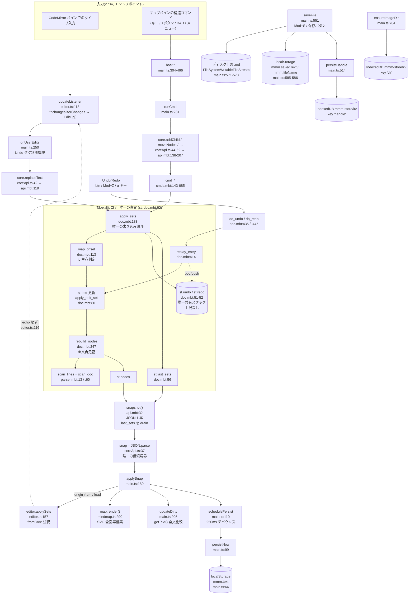

# mmm コードベース地図

対象リポジトリ: `D:/1.atrium/mmm`
本書の全ての事実主張には `path:行` を付す。読んで確認できなかったことは「未確認:」と明記する。
本書は地図であり、評価・修正提案は含まない。

**アーキテクチャ主張の検証結果**: 「Markdown テキストが唯一の真実。ノードツリーは導出。両ペインからの変更はすべて文字オフセット編集となり単一 Undo スタックに載る」は、コア側では成立する。`st.text` を書き換えるのは `apply_sets`(core/doc.mbt:198) と `replay_entry`(core/doc.mbt:421, core/doc.mbt:426) と `init_doc`(core/api.mbt:100) のみ。`st.nodes` を生成するのは `rebuild_nodes`(core/doc.mbt:318) のみ。cmds.mbt の 13 個の `cmd_*` はすべて `apply_sets` 経由でのみ文書を変更する(core/cmds.mbt:150, :167, :184, :211, :225, :242, :302, :371, :418, :493, :654, :675)。唯一の例外は `move_block` が `apply_sets` の後にノード id を直接書き戻す処理(core/cmds.mbt:508)。
ただし UI 側には一箇所ずれがある: `applySnap` は origin が `"cm"` / `"load"` のとき `snap.editSets` を CodeMirror へ適用しない(src/main.ts:183)。この経路ではコアのテキストと CodeMirror のテキストの一致は検証されない。

**読解時の罠**: `src/mindmap.ts:109` のキャッシュキー区切りは**リテラル NUL バイト**(`font + "\0" + text`)。`od -c` で `" \0 "` を確認済み。このためファイル全体が binary 扱いになり ripgrep / Grep は無言で空を返す。Read ツールはこの NUL を空白として表示するため、画面上は `font + " " + text` に見える。

---

## 1. ディレクトリ構成と各モジュールの責務

| path | 行数 | 責務 |
|---|---|---|
| `core/core.mbt` | 4 | コメントのみ。アーキテクチャ宣言(core/core.mbt:1-4)。コードなし。 |
| `core/parser.mbt` | 237 | 行スキャナ。テキスト → 行スパン → 見出し / `---` 区切り / `<!-- -->` 非表示領域。フェンス認識(core/parser.mbt:75-87)。 |
| `core/doc.mbt` | 527 | 唯一のグローバル文書状態 `st`(core/doc.mbt:62)と書き込み経路。編集セット適用・反転・id 引き継ぎ・ノード再導出・Undo/Redo スタック。 |
| `core/cmds.mbt` | 685 | 構造コマンド層。木レベル操作(子/兄弟/親/根の追加、改名、削除、インデント、移動、並べ替え、非表示、コピー)を文字オフセット編集へ降ろす。 |
| `core/api.mbt` | 230 | 公開 API 19 本(`pub fn` 19 件を確認)。文字列入力 → JSON 文字列出力。`snapshot()`(core/api.mbt:32)が唯一のワイヤ契約。 |
| `core/js/exports.mbt` | 110 | `#export_name` による camelCase 再輸出 18 本(`#export_name` 18 件を確認)。ロジック・検証ゼロの素通し。 |
| `core/core_test.mbt` | 431 | コアの全テスト 44 本(`^test "` 44 件を確認)。`pnpm test:core`(package.json:11)でのみ実行。 |
| `core/moon.mod` | 24 | モジュール名 `mmm-app/core`(core/moon.mod:12)、`preferred_target = "js"`(core/moon.mod:22)。 |
| `core/moon.pkg` | 1 | `pkgtype(kind: "library")`。 |
| `core/js/moon.pkg` | 5 | `pkgtype(kind: "foreign_library")` + `import { "mmm-app/core" @core }`。 |
| `src/main.ts` | 1135 | アプリシェル。選択・アンカー・Undo タグ状態機械・ファイル I/O・永続化・画像パイプライン・エクスポート・テーマ・ペイン表示・グローバルショートカット。`applySnap`(src/main.ts:180)が全同期の漏斗。 |
| `src/mindmap.ts` | 1814 | マップペイン全体。ビューモデル導出、フレームベースのツリーレイアウト、SVG 全面再構築、パン/ズーム/選択/ドラッグ再親付け、ラベル編集オーバーレイ、vim 風キーマップ、コンテキストメニュー、`exportSvg`。 |
| `src/editor.ts` | 188 | Markdown ペイン。history 拡張なしの CodeMirror 6。ユーザ編集 → `EditOp[]` + userEvent、コア編集セットの適用、選択ハイライト。 |
| `src/coreApi.ts` | 66 | MoonBit コアの型付きファサード 18 メソッドと、唯一の信頼境界 `snap`(src/coreApi.ts:37)。 |
| `src/relevel.ts` | 55 | 貼り付け断片のフェンス認識レベル調整。コアの走査規則を TS で再実装(src/relevel.ts:1-2)。 |
| `src/popup.ts` | 236 | モーダル 3 種(コード / リンク / お絵描き)。同期 `collect()` 契約(src/popup.ts:6, :59)。 |
| `src/fs-access.d.ts` | 64 | Chromium File System Access API の型宣言。ピッカー 3 種(src/fs-access.d.ts:53-64)と `queryPermission`/`requestPermission`(src/fs-access.d.ts:28-29, :44-45)。 |
| `src/style.css` | 328 | 視覚システム全体。`:root` に 14 個の CSS カスタムプロパティ(src/style.css:1-17)、`:root.light` で 11 個を上書き(src/style.css:19-32)。`@media` は 0 件。 |
| `index.html` | 44 | DOM 骨格。トップバー + 2 ペイン + スプリッタ。ロード資源は `/favicon.svg`(index.html:7)と `/src/main.ts`(index.html:42)の 2 つのみ。CSP なし。 |
| `package.json` | 26 | スクリプト 6 本(package.json:6-13)。`tsc --noEmit` は `build` にのみ存在(package.json:10)。 |
| `tsconfig.json` | 16 | `include: ["src"]`(tsconfig.json:15)、`strict`(:7)、`allowJs`(:10)、`skipLibCheck`(:11)。`checkJs` なし。 |
| `pnpm-workspace.yaml` | 2 | `allowBuilds: esbuild: true` のみ。`packages:` キーなし。 |
| `public/favicon.svg` | 6 | 静的ファビコン。`transform="translate(117.2,23) scale(-0.68,0.68)"`(public/favicon.svg:3)。 |
| `.gitignore` | 3 | `node_modules/`, `dist/`, `core/_build/`。 |
| `.claude/launch.json` | 11 | プレビュー起動設定。`pnpm run dev` を port 5173 で起動(.claude/launch.json:6-8)。 |
| `README.md` | 173 | 日本語の構成説明ドキュメント(README.md:1-12 を確認)。実行コードではない。 |
| `mmm.md` | 527 | 企画書 / 仕様書。コード中のコメントが参照する「spec」「mmm.md そのに」の実体(mmm.md:1-12 を確認)。 |

`src/main.ts` 内で `$()`(src/main.ts:12)が index.html から解決する id は 16 個: md-pane, map-pane, btn-open, btn-save, btn-undo, btn-redo, filename, dirty, logo(src/main.ts:18-26)、panes, btn-view-md, btn-view-map(src/main.ts:915-917)、splitter(src/main.ts:969)、btn-export-svg, btn-export-webp(src/main.ts:1066, :1069)、btn-theme(src/main.ts:1086)。
一方、`src/style.css` がスタイルする id のうち 6 個は index.html に存在せず実行時に生成される: `#map-svg`(src/style.css:115 / src/mindmap.ts:212)、`#drop-line`(:263 / :216)、`#rubber`(:269 / :240)、`#node-editor`(:277 / :244)、`#ctx-menu`(:291 / :257)、`#map-hint`(:317 / :249)。

---

## 2. データフロー(入力 → 状態 → 描画 → 永続化)

### 2.1 図



### 2.2 経路の逐次説明

**入口 A: Markdown ペインでのタイプ入力**

1. CodeMirror がトランザクションを発行。`updateListener`(src/editor.ts:113)が `docChanged` かつ `fromCore` 注釈なしのものだけを拾う(src/editor.ts:116)。
2. userEvent を固定優先順リスト(src/editor.ts:118-126: `input.type.compose`, `input.type`, `delete.backward`, `delete`, `input.paste`, `move.drop`, `input`)から 1 つ選ぶ。`input.type.compose` が接頭辞 `input.type` より先に並ぶ順序は必須(src/editor.ts:119 のコメント)。
3. `tr.changes.iterChanges` が `EditOp{from: fromA, to: toA, insert}` を生成(src/editor.ts:133-139)。オフセットはトランザクション適用**前**の文書座標。
4. `onUserEdits`(src/main.ts:250)が Undo タグを決める。`compose.end` は `typeKind` を空にして即 return(src/main.ts:251-254)。単一の純挿入で `input.type` かつ `e.from === typePos` なら前のタグを再利用(src/main.ts:269-276)、単一の純削除で `delete.backward` かつ `e.to === typePos` なら同様(src/main.ts:277-285)。それ以外は `typeKind = ""`(src/main.ts:287)でタグ空 = マージなし。
5. 各 `EditOp` を running delta 付きで `core.replaceText` に流す(src/main.ts:295-298)。返った最後の Snapshot を `applySnap(snap, "cm")`(src/main.ts:299)。

**入口 B: マップペインからの構造コマンド**

1. キーダウン(src/mindmap.ts:1325)、`+` ボタン(src/mindmap.ts:1235, :1242)、ドラッグ解放(src/mindmap.ts:1159)、コンテキストメニュー(src/mindmap.ts:1720-1771)のいずれかが `MapHost` のメソッド(src/mindmap.ts:12-46)を呼ぶ。マップペインは変更用の文字オフセットを一切計算しない。
2. `host` 実装(src/main.ts:304-466)がセッションタグ `s{n}` を採番し `runCmd`(src/main.ts:231)へ。
3. `runCmd` が `core.*` を呼び、`applySnap(snap, "map")`、`snap.focus` が生存していれば選択・スクロール・(必要なら)ラベル編集開始(src/main.ts:235-241)。

**合流点: MoonBit コア**

4. `coreApi.ts` の各メソッド(src/coreApi.ts:39-66)が `core/js/exports.mbt` の camelCase 輸出を呼ぶ。`exports.mbt` は引数検証ゼロの素通し(core/js/exports.mbt:5-110)。
5. `api.mbt` の `pub fn`(core/api.mbt:99-230)が `cmd_*` / `do_*` を呼び、`snapshot()` を返す。`replace_text` だけは範囲チェックを持ち、`from < 0 || to > n || from > to` および `removed == insert` で無変更 snapshot を返す(core/api.mbt:126-132)。
6. `cmd_*`(core/cmds.mbt:143-685)は導出済み `st.nodes` を**オフセット計算のためだけに**読み、`Edit` 配列を組んで `apply_sets` に渡す。
7. `apply_sets`(core/doc.mbt:183)が唯一の書き込み漏斗。順に: `before = id_pairs()`(core/doc.mbt:184)→ 各ノードの `hs` を `map_offset` で編集を跨いで運ぶ(core/doc.mbt:192-196)→ 逆セット生成 `invert_edit_set`(core/doc.mbt:197)→ `st.text = apply_edit_set(...)`(core/doc.mbt:198)→ 生存オフセット→旧 id の写像 `id_at` 構築(core/doc.mbt:200-205)→ `rebuild_nodes(id_at)`(core/doc.mbt:206)→ `st.rev++`(core/doc.mbt:207)→ `st.last_sets` へ追記(core/doc.mbt:208-210)。
8. Undo スタックの位置: `apply_sets` の末尾(core/doc.mbt:212-240)。トランザクションが開いていれば `tx.steps`/`tx.inv` に積むだけ(core/doc.mbt:213-218)。開いていなければ `st.redo.clear()`(core/doc.mbt:220)の後、`tag != ""` かつ**現在のトップ**エントリのタグが一致すればマージ(core/doc.mbt:221-235)、さもなくば新規 `Entry` を push(core/doc.mbt:237)。複数ノードコマンドは `begin_tx`/`commit_tx` で 1 手にまとめる(core/cmds.mbt:394/:427, :528/:568)。
9. `rebuild_nodes`(core/doc.mbt:247)がテキストを**全文**再走査。`scan_lines`(core/parser.mbt:13)→ `scan_doc`(core/parser.mbt:60)→ 重複 depth-1 見出しを構造から除外(core/doc.mbt:252-262)→ 見出し直上の `---` のみ区切りとして採用(core/doc.mbt:266-276)→ `id_at` から id を継承、なければ `st.next_id++`(core/doc.mbt:281-288)→ `has_content` 判定(core/doc.mbt:295)→ スタックで `sub_end` 解決(core/doc.mbt:311-317)→ `recompute_parents()`(core/doc.mbt:319)→ `compute_groups(seps)`(core/doc.mbt:320)。
10. `snapshot()`(core/api.mbt:32)が rev / focus / canUndo / canRedo / editSets / nodes の 6 キー固定順 JSON を手組みする。**`text` フィールドは存在しない**。副作用として `st.last_sets = []`(core/api.mbt:93)と `st.focus = -1`(core/api.mbt:94)を行う。つまり snapshot は 1 回しか読めない。

**出口へのファンアウト**

11. `snap = JSON.parse`(src/coreApi.ts:37)。try/catch なし、形状検証なし。
12. `applySnap`(src/main.ts:180): `nodes` / `byId` を丸ごと差し替え(src/main.ts:181-182)。
13. **CodeMirror 文書更新**: `origin !== "cm" && origin !== "load"` のときだけ `editor.applySets(snap.editSets)`(src/main.ts:183)。`applySets`(src/editor.ts:157)はセット 1 つにつき 1 dispatch、セット内の全 op を 1 つの `changes` 配列で渡し(src/editor.ts:160-163)、`fromCore` 注釈を付けるので echo しない(src/editor.ts:116)。
14. **選択の刈り込み**: 消えたノード id を `selection` から削除、アンカーが死んだら Set 挿入順の最後の生存 id へフォールバック(src/main.ts:186-195)。
15. **タイピングマージ鎖の切断**: `origin !== "cm"` なら `typeKind = ""`(src/main.ts:197)。
16. **SVG 再描画**: `map.render()`(src/main.ts:198 → src/mindmap.ts:290)。毎スナップショットで無条件に呼ばれる。
17. **Undo/Redo ボタン**: `btnUndo.disabled = !snap.canUndo` / `btnRedo.disabled = !snap.canRedo`(src/main.ts:200-201)。スタック深さは JS 変数に持たない。
18. **dirty ドット**: `updateDirty()`(src/main.ts:206)が `core.getText() === savedText` の全文比較。毎スナップショット実行。
19. **localStorage**: `schedulePersist()`(src/main.ts:203)→ **250ms デバウンス**(src/main.ts:112)→ `persistNow`(src/main.ts:99)が `localStorage["mmm.text"]` に**文書全文**を書く(src/main.ts:105)。quota 例外は握り潰す(src/main.ts:106-108)。`pagehide` でデバウンス窓を捨てずに即書き(src/main.ts:115)。
20. **選択ミラー**(選択集合が変わったときのみ): `syncSelectionViews`(src/main.ts:210)が選択ノード id を `{from: n.hs, to: n.subEnd}` の文字範囲に変換して `editor.highlight`(src/editor.ts:168)へ渡し、`map.refreshSelection()`(src/mindmap.ts:1807)を呼ぶ。
21. **IndexedDB**: ファイルハンドルは `persistHandle`(src/main.ts:514)→ `idbSet("handle", fileHandle)`。画像フォルダ許可は `ensureImageDir`(src/main.ts:714-716)→ `idbSet("dir", picked)`。どちらも fire-and-forget、catch は空。
22. **ディスク上の .md**: `saveFile`(src/main.ts:551)のみ。`core.getText()`(src/main.ts:552)を読み、復元ハンドルの権限を再取得(src/main.ts:557-561)、`createWritable` → `write` → `close`(src/main.ts:571-573)。非 FS ブラウザでは `<a download>` blob(src/main.ts:576-580)。成功後 `savedText` を更新し `mmm.savedText` / `mmm.fileName` を書く(src/main.ts:582-586)。

**Undo/Redo の経路**

23. トリガは 3 つ: ツールバーボタン(src/main.ts:500-501)、window capture-phase の Mod+Z / Mod+Y(src/main.ts:901-906、`stopPropagation` 付き)、マップペインの `u` キー(src/mindmap.ts:1411-1414)。マップペイン側に redo のキーバインドはない(`MapHost.redo` は src/mindmap.ts:45 で宣言されるが、`grep -a redo src/mindmap.ts` の結果は宣言行のみ)。
24. `doUndo`/`doRedo`(src/main.ts:492-499)→ `core.undo()`/`core.redo()` → `do_undo`/`do_redo`(core/doc.mbt:435/:445)→ `replay_entry`(core/doc.mbt:414)。undo は逆順で `entry.inv` を適用し `entry.before` の (hs,id) 対を復元、redo は正順で `entry.steps` を適用し `entry.after` を復元。`replay_entry` は `map_offset` を使わず、`rebuild_nodes(pairs_map(pairs))` 1 回で id をオフセット一致により復元する(core/doc.mbt:430)。
25. 結果は `applySnap(..., "core")`(src/main.ts:493, :497)で通常の出口へ。origin が `"core"` なので editSets は CodeMirror に適用される。その後明示的に `syncSelectionViews(false)`(src/main.ts:494, :498)。

### 2.3 デバウンス / タイマー一覧

| 対象 | 時間 | path:行 |
|---|---|---|
| localStorage への文書全文書き込み | 250 ms | src/main.ts:112 |
| vim 2 ストロークシーケンス(dd/yy/cc/gg/zz)の受付窓 | 700 ms | src/mindmap.ts:1346 |
| ファイル名ラベルのフラッシュメッセージ復帰 | 4000 ms | src/main.ts:609 |

これ以外にデバウンス・スロットルは存在しない。`map.render()`、`updateDirty()`、`applySnap()` はいずれも 1 編集ごとに同期実行される。

---

## 3. markdown テキスト ⇄ ノードツリー の変換関数(全件)

### 3.1 方向: text → tree(テキストから構造を導出)

| 関数 | path:行 | 方向 | 何をするか |
|---|---|---|---|
| `scan_lines` | core/parser.mbt:13 | text→tree | 段階 1。String を `Line{start, end, next}` の配列へ。LF で分割し、直前の CR は `end` から除く(core/parser.mbt:21-23)。末尾が改行で終わるテキストは末尾の空 Line を作らない(ガード core/parser.mbt:29)。空文字列は長さ 0 の Line を 1 本生む。 |
| `scan_doc` | core/parser.mbt:60 | text→tree | 段階 2。行配列 → (見出し配列, `---` 区切り, `<!-- -->` 領域)。1 行につき「フェンス内 → フェンス開始 → `<!--` → `-->` → `---` → 見出し」の排他判定(各分岐が `continue`)。閉じない領域は close を (-1,-1) で push(core/parser.mbt:129-131)。ラベル String を実体化する唯一の場所(core/parser.mbt:124)。 |
| `is_space` | core/parser.mbt:46 | text→tree(補助) | 32(空白)または 9(タブ)のみ真。CR(13)は含まない。 |
| `is_marker_line` | core/parser.mbt:137 | text→tree(補助) | 行の前後空白・末尾 CR を除いた内容が marker と完全一致するか。`<!--` / `-->` 判定用。 |
| `is_separator` | core/parser.mbt:152 | text→tree(補助) | 先頭空白 3 個まで + ダッシュ 3 個以上 + 行末まで空白のみ。 |
| `fence_open` | core/parser.mbt:179 | text→tree(補助) | (フェンス文字, 長さ) を返す。インデント 3 まで、バッククォート/チルダ 3 個以上。バッククォートフェンスは info 文字列にバッククォートを含むと不成立(core/parser.mbt:201-209)。 |
| `fence_close_len` | core/parser.mbt:215 | text→tree(補助) | 同じフェンス文字の連続長。その後は空白のみ必須。呼び出し側が開始長以上で閉じる(core/parser.mbt:76)。 |
| `rebuild_nodes` | core/doc.mbt:247 | text→tree | 段階 3。見出し → `Node` 配列。重複 depth-1 の除外、区切りの採否、id 継承、`has_content`、`sub_end`、親、グループを決定。**1 編集ごとに文書全体に対して走る**。 |
| `is_blank_range` | core/doc.mbt:324 | text→tree(補助) | `st.text` の [a,b) が空白/タブ/LF/CR のみか。グローバル `st.text` を直接読む。 |
| `recompute_parents` | core/doc.mbt:472 | text→tree(補助) | 深さのスタックから親 id を決定。より浅い先行ノードがなければ `-1`(独立トップレベル木)。 |
| `compute_groups` | core/doc.mbt:339 | text→tree(補助) | 2 パス。パス 1 で区切り数を累積した生グループ値を親ごとに連鎖、パス 2 で親ごとに 0 始まり密インデックスへ正規化。 |
| `find_node` | core/doc.mbt:489 | tree(補助) | id → `st.nodes` の添字、なければ -1。線形走査。 |
| `normalize_selection` | core/doc.mbt:502 | tree(補助) | 選択 id 群から、他の選択ノードの [hs, sub_end) に**厳密に内包される**ものを落とし、文書順の**添字**配列を返す。親子鎖ではなくテキスト範囲による包含判定。 |
| `snap` | src/coreApi.ts:37 | text→tree | コアの JSON 文字列 → `Snapshot`(`nodes: NodeInfo[]` を含む)。`JSON.parse` を無検証でキャスト。唯一の信頼境界。 |
| `scanDepths` | src/relevel.ts:5 | text→tree | 貼り付け断片の行ごとの見出し深さ(0 = 見出しでない)。フェンス認識。コア規則の TS 再実装。 |
| `hasHeadings` | src/relevel.ts:36 | text→tree | `scanDepths` に非フェンス見出しが 1 つでもあるか。貼り付けゲート(src/main.ts:402)。 |
| コンテンツ行スキャン(`render` 内) | src/mindmap.ts:313-379 | text→tree | 生 Markdown(`n.he` の次の改行から、次ノードの `hs` または `n.subEnd` まで)を `CardRow[]` に変換。最大 4 行。非表示ノード・コンテンツなしノードは空(src/mindmap.ts:318-321)。 |
| `parseLink` | src/mindmap.ts:119 | text→tree | `[text](https?://…)` またはむき出し http/https URL → `LinkInfo{title,url,host}`。`new URL()` で検証。それ以外は null。 |
| `parseImage` | src/mindmap.ts:144 | text→tree | `` かつ**ローカル相対パスのみ** → `{path, name}`。URI スキームを持つものは拒否(src/mindmap.ts:148)。先頭 `./` を剥がす。 |
| `widthOf` / `heightOf` / `calcV` / `stackV` / `placeF` / `placeSide` | src/mindmap.ts:393 / :387 / :436 / :425 / :448 / :517 | text→tree(第 2 段導出) | `NodeInfo` + `CardRow[]` → 絶対座標 `Box`。毎 render で全再計算。テキストへは何も書き戻さない。 |

### 3.2 方向: tree-op → text-edit(木の操作を文字オフセット編集へ降ろす)

| 関数 | path:行 | 方向 | 何をするか |
|---|---|---|---|
| `apply_sets` | core/doc.mbt:183 | tree-op→text-edit | 接合点。編集セットを受けてテキストを書き換え、ツリーを再導出し、id を運び、Undo エントリを記録する。全木操作がここを通る。 |
| `map_offset` | core/doc.mbt:113 | tree-op→text-edit | id 継承規則。前編集の見出し開始オフセットを後編集オフセットへ写す、または破壊されたなら -1。`p == e.from` かつ削除範囲ありのとき、`insert` が非空なら生存(core/doc.mbt:123)、空なら -1(core/doc.mbt:126)。`p == e.from` の純挿入は、挿入文字列の最後のコードユニットが LF のときだけ右へずらす(core/doc.mbt:132-134)。 |
| `insert_heading_edit` | core/cmds.mbt:74 | tree-op→text-edit | 「ここに空の新ノード」を 1 本の純挿入 Edit と prefix 長へ具体化。行途中なら改行 2、空行が前にないなら改行 1、`split` なら `---` + 改行 2、`hashes(depth) + " " + br`、EOF でなければ末尾に改行 1。 |
| `cmd_add_child` | core/cmds.mbt:143 | tree-op→text-edit | `nd.sub_end` に depth+1 で 1 本挿入(常に最後の子)。 |
| `cmd_add_sibling` | core/cmds.mbt:155 | tree-op→text-edit | `nd.sub_end` に同 depth で挿入。depth-1 は `cmd_add_child` に委譲(core/cmds.mbt:161-165)。 |
| `cmd_add_sibling_before` | core/cmds.mbt:173 | tree-op→text-edit | `nd.hs` に同 depth で挿入。depth-1 は同様に委譲(core/cmds.mbt:179-182)。 |
| `cmd_add_parent` | core/cmds.mbt:192 | tree-op→text-edit | 1 セットで [`nd.hs` への見出し挿入] + [部分木の全見出しへの `"#"` 長さ 0 挿入](core/cmds.mbt:201-210)。depth 1 は何もしない(core/cmds.mbt:198-200)。 |
| `cmd_add_root` | core/cmds.mbt:216 | tree-op→text-edit | depth-1 ノードが既にあれば拒否(core/cmds.mbt:218-222)、なければ EOF に `# ` を追加(core/cmds.mbt:223)。 |
| `cmd_rename` | core/cmds.mbt:231 | tree-op→text-edit | [hs, he) を `hashes(depth) + " " + sanitize_label` で 1 回置換。正規化後が同一なら何もしない(core/cmds.mbt:239-241)。 |
| `cmd_delete` | core/cmds.mbt:250 | tree-op→text-edit | 正規化選択の各 [hs, sub_end) を 1 セットの昇順削除に。EOF に達する連鎖には `tidy_del_start` を適用し、直前範囲の終端でクランプ(core/cmds.mbt:285-296)。 |
| `cmd_indent` | core/cmds.mbt:351 | tree-op→text-edit | 前兄弟を持つ選択部分木の全見出しに `"#"` を 1 個挿入。行は 1 つも動かない(core/cmds.mbt:356-366)。 |
| `cmd_outdent` | core/cmds.mbt:380 | tree-op→text-edit | 1 tx 内で逆文書順に処理。depth<3 はスキップ(core/cmds.mbt:387)。親の最後のブロックなら純深さ変更(`"#"` を 1 個削除、core/cmds.mbt:409-419)、さもなくば `move_block`(core/cmds.mbt:421)。 |
| `move_block` | core/cmds.mbt:437 | tree-op→text-edit | 再配置プリミティブ。ブロックのテキストを delta 個の `#` 増減で再生成、末尾改行を剥がし、EOF なら `br`、そうでなければ `br+br` を付け、直前が空行でなければ先頭に `br`。`[ins, del]` か `[del, ins]` を昇順で発行(core/cmds.mbt:492)。その後 `apply_sets` の外でノード id を復元(core/cmds.mbt:505-511)、`recompute_parents()`(core/cmds.mbt:512)、`refresh_entry_after()`(core/cmds.mbt:513)。 |
| `cmd_move` | core/cmds.mbt:519 | tree-op→text-edit | tx 内の複数ノード移動。pos 0/1/2 = 最後の子 (`tn.sub_end`, depth+1) / 前 (`tn.hs`, depth) / 後 (`tn.sub_end`, depth)(core/cmds.mbt:544-550)。移動中の部分木内への drop は拒否(core/cmds.mbt:541-543)。各移動後アンカーを移動済みノードに、pos を 2 に更新(core/cmds.mbt:562-563)。 |
| `cmd_reorder` | core/cmds.mbt:576 | tree-op→text-edit | dir<0 は前兄弟の `hs` へ、dir>=0 は次兄弟の `sub_end` へ `move_block`。 |
| `cmd_toggle_hidden` | core/cmds.mbt:626 | tree-op→text-edit | 表示 → 領域の `<!--`/`-->` マーカ行を削除(core/cmds.mbt:638-654)。非表示 → 部分木内にマーカがあれば拒否(core/cmds.mbt:661-667)、なければ `hs` に `<!--`+eol、`sub_end` に close を挿入(core/cmds.mbt:675-683)。hidden フラグ自体は保存されず、パーサが再導出する。 |
| `focus_node_at` | core/cmds.mbt:132 | tree-op(補助) | 再構築後、指定 hs のノード id を `st.focus` に。なければ -1。 |
| `tidy_del_start` | core/cmds.mbt:105 | tree-op→text-edit(補助) | 削除開始を空白行の連なりを遡って広げる。常に `ss` 以下。 |
| `preceded_by_blank` | core/cmds.mbt:51 | tree-op→text-edit(補助) | オフセット `at` の直前が空行(または先頭)か。 |
| `subtree_nodes` | core/cmds.mbt:337 | tree-op(補助) | [ss, se) 内に `hs` を持つ見出しの添字群。深さ変更が触るべき行の集合。 |
| `prev_sibling` / `next_sibling` | core/cmds.mbt:307 / :322 | tree-op(補助) | より浅いノードに当たる前の同深さノードを前方/後方に探索。グループ・非表示は無視。 |
| `runCmd` | src/main.ts:231 | tree-op→text-edit | 全構造コマンドの UI 側入口。コアを呼び、`applySnap` 経由でのみ md ペインへ届ける。 |
| `insertContentLine` | src/main.ts:722 | tree-op→text-edit | ノード id → 文字オフセット(部分木内に次ノードがあればその `hs`、なければ `subEnd`、src/main.ts:726-729)に変換し、空行パディング付きの `core.replaceText` 挿入 1 本。リンク/コード/お絵描きポップアップの着地点。 |
| `MdEditor.applySets` | src/editor.ts:157 | tree-op→text-edit | `EditOp[][]` → CodeMirror `ChangeSpec[]`。セット 1 つにつき 1 dispatch、`fromCore` 注釈付き。 |
| `MapHost` の 20 個のミューテータ | src/mindmap.ts:25-45 | tree-op→text-edit | マップペインの外向き契約。addChild / addSibling / addSiblingBefore / addParent / addRoot / rename / commitEdit / deleteSelection / indentSelection / outdentSelection / reorder / toggleHidden / move / copySelection / paste / addLink / addCode / addDrawing / editRequested / undo / redo。マップ自身はオフセットを計算しない。 |
| ラベル編集 `input` → `host.rename` | src/mindmap.ts:1274-1279 | tree-op→text-edit | 1 打鍵ごとに `rename(id, value, editingTag)` を即時発行。遅延コミットではなくテキスト編集の連続。 |

### 3.3 方向: tree → text(ツリーからテキストを生成)

| 関数 | path:行 | 方向 | 何をするか |
|---|---|---|---|
| `snapshot` | core/api.mbt:32 | tree→text | ノードツリー + 保留編集セット → JSON 文字列。**表示用の導出ツリーを直列化するだけで、Markdown は書かない**。 |
| `json_escape` | core/api.mbt:7 | text→text | MoonBit 文字列 → JSON 文字列本体。`"` `\` `\n` `\r` `\t` と 32 未満を `\u00xx`。U+2028/2029 と孤立サロゲートはエスケープしない。 |
| `selection_text` | core/cmds.mbt:597 | tree→text | 選択部分木の Markdown 断片(コピー/カット用)。各ブロックの末尾改行を剥がし空行で連結、文書自身の改行種別を使用。デデントなし、`---` は持ち越さない。 |
| `id_pairs` | core/doc.mbt:148 | tree→text(補助) | 文書順の (hs, id) スナップショット。Undo エントリの `before`/`after` の中身。 |
| `pairs_map` | core/doc.mbt:157 | text→tree(補助) | (hs,id) 配列 → `Map[hs → id]`。undo/redo 時の `rebuild_nodes` 入力。 |
| `syncSelectionViews` | src/main.ts:210 | tree→text | 選択ノード id → md ペインの文字範囲 `{from: n.hs, to: n.subEnd}`。選択のテキスト方向ミラー。 |
| `core.selectionText` | src/main.ts:376 | tree→text | コピー/カットでコアに Markdown 直列化を依頼。 |
| `exportSvg` | src/mindmap.ts:778 | tree→text | 描画済みツリー → 自己完結 SVG 文書(計算済みスタイル 11 プロパティをインライン化、blob サムネイルを data URL 化)。戻り値は `SVGSVGElement` だが直列化方向。 |

### 3.4 方向: text → text(テキスト内変換)

| 関数 | path:行 | 方向 | 何をするか |
|---|---|---|---|
| `apply_edit_set` | core/doc.mbt:80 | text→text | 昇順・非重複の編集セット 1 つを String に適用。検証は一切しない。 |
| `invert_edit_set` | core/doc.mbt:94 | text→text | 逆セット生成。オフセットは適用**後**のテキストで有効。`removed` をそのまま挿入文字列に使うため、呼び出し側が `removed` を正しく詰めていることに完全依存。 |
| `replay_entry` | core/doc.mbt:414 | text→text | エントリの編集セットをテキストへ再生(redo は正順、undo は逆順で `inv`)。その後 `rebuild_nodes` 1 回で id を復元。 |
| `hashes` | core/cmds.mbt:7 | text→text | `#` を n 個。n<=0 で空文字(`move_block` の delta==0 が依存)。 |
| `sanitize_label` | core/cmds.mbt:16 | text→text | `\n`/`\r` を空白に置換してから前後の空白/タブをトリム。先頭の `#` は剥がさない。 |
| `nl` | core/cmds.mbt:39 | text→text | `st.text` の**最初の**改行から `"\r\n"` か `"\n"` を決める(doc コメントは "Dominant" と書く、core/cmds.mbt:38)。改行がなければ `"\n"`。呼び出しごとに O(len) 走査。 |
| `cc` / `sub` | core/doc.mbt:7 / :12 | text→text(基礎) | `cc(s,i)` = 位置 i のコードユニット、`sub(s,a,b)` = 部分文字列。システム全体のオフセットは全てこれ由来の String 添字 = UTF-16 コードユニット。 |
| `relevel` | src/relevel.ts:40 | text→text | 断片の最浅見出しが `targetDepth` になるよう全非フェンス見出しをシフト。見出しなし・delta 0 なら入力をそのまま返す(src/relevel.ts:45, :47)。delta≠0 の経路は `\n` で再結合(src/relevel.ts:54)。 |
| `clipLabel` | src/mindmap.ts:731 | text→text | 二分探索による省略記号切り詰め(表示のみ)。原文は無変更で `<title>` に完全ラベルを保持(src/mindmap.ts:613-614)。 |
| `onUserEdits` | src/main.ts:250 | text→text | CodeMirror の変更範囲を running delta 付きでコアへ再生。 |
| `host.paste` | src/main.ts:380 | text→text | クリップボードの Markdown を CRLF 正規化 → `hasHeadings` ゲート → `relevel(…, anchor.depth+1)` → `anchor.subEnd` に空行パディング付きで挿入(タグなし = 単独 Undo エントリ)。 |
| `MdEditor.setText` | src/editor.ts:149 | text→text | 文書全体の置換(ファイル open / new)。`fromCore` 注釈付き。 |

---

## 4. 状態の所在一覧

### 4.1 MoonBit コア

| 名前 | path:行 | 種別 | 何を保持 | 誰が書く | 誰が読む |
|---|---|---|---|---|---|
| `st` | core/doc.mbt:62 | MoonBit struct(グローバル 1 個) | 文書状態すべて。文書ハンドルはなく、複数文書は不可能 | doc.mbt / cmds.mbt / api.mbt の全関数 | 同左 |
| `st.text` | core/doc.mbt:49 | MoonBit struct field | **唯一の真実**。文書テキスト | `apply_sets`(core/doc.mbt:198)、`replay_entry`(core/doc.mbt:421, :426)、`init_doc`(core/api.mbt:100) | `rebuild_nodes`, `get_text`(core/api.mbt:114), 全 `cmd_*` |
| `st.nodes` | core/doc.mbt:50 | MoonBit struct field | 導出ノード配列(文書順) | `rebuild_nodes`(core/doc.mbt:318)が丸ごと置換。個別フィールドは `recompute_parents`(core/doc.mbt:479)、`compute_groups`(core/doc.mbt:377, :385)、`move_block` の id 復元(core/cmds.mbt:508) | `snapshot`(core/api.mbt:65-91), 全 `cmd_*` |
| `st.undo` / `st.redo` | core/doc.mbt:51-52 | MoonBit struct field | **単一共有 Undo スタック**。上限なし。各 `Entry` は全編集の `removed` テキストを保持 | `apply_sets`(core/doc.mbt:220, :237)、`commit_tx`(core/doc.mbt:403-404)、`do_undo`/`do_redo`/`do_abort`(core/doc.mbt:439-465)、`init_doc`(core/api.mbt:101-102) | `snapshot` の canUndo/canRedo(core/api.mbt:39, :41) |
| `st.rev` | core/doc.mbt:53 | MoonBit struct field | 単調増加リビジョン | `apply_sets`(core/doc.mbt:207)、`replay_entry`(core/doc.mbt:431)、`init_doc`(core/api.mbt:108) | `snapshot`(core/api.mbt:35) |
| `st.next_id` | core/doc.mbt:54 | MoonBit struct field | 新規 id 発番カウンタ | `rebuild_nodes`(core/doc.mbt:285)。リセットは `init_doc`(core/api.mbt:104)のみ | `rebuild_nodes` |
| `st.focus` | core/doc.mbt:55 | MoonBit struct field | コマンド後に UI がフォーカスすべきノード id、なければ -1 | `focus_node_at`(core/cmds.mbt:133, :136)、cmds.mbt:246, :303, :373, :429, :514, :570, :655, :684 | `snapshot`(core/api.mbt:37)。読んだ直後に -1 へリセット(core/api.mbt:94) |
| `st.last_sets` | core/doc.mbt:56 | MoonBit struct field | 当該 API 呼び出し中に適用された編集セット(適用順、undo の逆セットも含む) | `apply_sets`(core/doc.mbt:209)、`replay_entry`(core/doc.mbt:422, :427) | `snapshot`(core/api.mbt:43-63)。drain される(core/api.mbt:93) |
| `st.tx` | core/doc.mbt:57 | MoonBit struct field | 開いているトランザクション | `begin_tx`(core/doc.mbt:393)、`commit_tx`(core/doc.mbt:400)、`init_doc`(core/api.mbt:103) | `apply_sets`(core/doc.mbt:212)、`refresh_entry_after`(core/doc.mbt:170) |
| `st.hide_regions` | core/doc.mbt:58 | MoonBit struct field | `<!-- -->` マーカのスパン (open_start, open_next, close_start, close_next) | `rebuild_nodes`(core/doc.mbt:250) | `cmd_toggle_hidden`(core/cmds.mbt:634, :661)のみ |
| `Entry.after` | core/doc.mbt:30 | MoonBit struct field(唯一の可変 Entry フィールド) | コマンド後の (hs,id) スナップショット | タグマージ(core/doc.mbt:228)、`commit_tx`(core/doc.mbt:402)、`refresh_entry_after`(core/doc.mbt:174) | `do_redo`(core/doc.mbt:450) |
| `Node.id` / `parent` / `group` / `sub_end` | core/doc.mbt:35, :40-42 | MoonBit struct field(可変) | ノード同一性・親・グループ・部分木終端 | `rebuild_nodes`、`recompute_parents`、`compute_groups`、`move_block`(core/cmds.mbt:508) | 全 `cmd_*`、`snapshot` |
| `scan_doc` のフェンス/コメントローカル | core/parser.mbt:67-72 | 閉包(呼び出しローカル) | in_fence, fence_char, fence_len, in_comment, c_open, c_open_next | `scan_doc` のループ | 同ループ。**意図的に永続化されない**ためパーサは呼び出し間で無状態 |

### 4.2 TypeScript モジュールスコープ変数

| 名前 | path:行 | 種別 | 何を保持 | 誰が書く | 誰が読む |
|---|---|---|---|---|---|
| `nodes` | src/main.ts:30 | モジュールスコープ変数 | 導出 `NodeInfo[]`(文書順) | `applySnap`(src/main.ts:181)が丸ごと置換 | `host.nodes()`(src/main.ts:305)、`insertContentLine`(src/main.ts:725-729)、`host.paste`(src/main.ts:383) |
| `byId` | src/main.ts:31 | モジュールスコープ変数 | id → NodeInfo 索引 | `applySnap`(src/main.ts:182) | 全ノード id の生存判定 |
| `selection` | src/main.ts:32 | モジュールスコープ変数 | **選択の権威**。`Set<number>` | `applySnap` の刈り込み(src/main.ts:187-190)、`setSelection`(src/main.ts:225) | `host.selection()`(src/main.ts:307)、`syncSelectionViews`(src/main.ts:212)、`host.deleteSelection` ほか |
| `anchorId` | src/main.ts:33 | モジュールスコープ変数 | フォーカス中ノード id、-1 = なし | `applySnap`(src/main.ts:193)、`setSelection`(src/main.ts:226) | `host.anchor()`(src/main.ts:308)、`pasteImage`(src/main.ts:839) |
| `sessionN` | src/main.ts:34 | モジュールスコープ変数 | Undo タグ採番カウンタ(`t{n}` = タイピング、`s{n}` = 構造)。リセットされない | `onUserEdits`(src/main.ts:272, :281, :291)、`host` の各コマンド(src/main.ts:314 ほか) | 同左 |
| `savedText` | src/main.ts:35 | モジュールスコープ変数 | 最終保存時のテキスト基準値 | `openFile`(src/main.ts:525, :536)、drop(src/main.ts:874)、`saveFile`(src/main.ts:582)、boot(src/main.ts:1113) | `updateDirty`(src/main.ts:207)、`confirmDiscard`(src/main.ts:613)、`beforeunload`(src/main.ts:852) |
| `fileHandle` | src/main.ts:36 | モジュールスコープ変数 | 保存先 `FileSystemFileHandle`。相対画像パスの基準 | `openFile`、drop、`saveFile`、boot の IDB 復元(src/main.ts:1119) | `saveFile`、`assetSegs`(src/main.ts:650)、`saveImageToDisk`(src/main.ts:748) |
| `fileName` | src/main.ts:37 | モジュールスコープ変数 | 表示名 / 保存候補名 / エクスポート基底名 / IDB ハンドル採用の照合キー | `loadText`(src/main.ts:474)、`saveFile`(src/main.ts:568) | `flashFilename`、`exportMap`(src/main.ts:1015)、boot(src/main.ts:1119) |
| `idbConn` | src/main.ts:70 | モジュールスコープ変数 | IndexedDB 接続 Promise のキャッシュ | `idb()`(src/main.ts:72、`??=`) | `idbSet` / `idbGet` |
| `persistTimer` | src/main.ts:98 | モジュールスコープ変数 | 250ms デバウンスの timeout id。-1 = 停止 | `persistNow` / `schedulePersist`(src/main.ts:102, :112) | 同左 |
| `typeTag` / `typeKind` / `typePos` | src/main.ts:246-248 | モジュールスコープ変数 | タイピングマージ鎖の状態(現タグ / `''`\|`type`\|`del`\|`compose` / 次打鍵が一致すべきオフセット) | `onUserEdits`(src/main.ts:252, :259-290)、`applySnap`(src/main.ts:197 で `typeKind` をクリア) | `onUserEdits` |
| `dirHandle` | src/main.ts:625 | モジュールスコープ変数 | 画像フォルダの許可ハンドル | `ensureImageDir`(src/main.ts:715)、`saveImageToDisk`(src/main.ts:767)、boot(src/main.ts:1125) | `loadAsset`(src/main.ts:656)、`unlockAssets`(src/main.ts:688) |
| `assetUrls` | src/main.ts:629 | モジュールスコープ変数 | md 相対パス → objectURL または null。null は「読み込み中 / 権限待ち / 欠落」の三義 | `imageUrl`(src/main.ts:639)、`loadAsset`(src/main.ts:677)、`clearAssets`(src/main.ts:633)、`saveImageToDisk`(src/main.ts:834) | `imageUrl`(src/main.ts:637)、`unlockAssets`(src/main.ts:689)、boot(src/main.ts:1128) |
| `flashTimer` | src/main.ts:600 | モジュールスコープ変数 | 4 秒後にファイル名を戻す timeout id | `flashFilename`(src/main.ts:604-606) | 同左 |
| `paneVis` | src/main.ts:914 | モジュールスコープ変数 | `{md, map}` の可視性。DOM クラスはこのミラー | `applyPaneVis`(src/main.ts:921) | `togglePaneVis`(src/main.ts:939)、`togglePane`(src/main.ts:951, :954) |
| `measureCtx` | src/mindmap.ts:95 | モジュールスコープ変数 | 計測用の切り離し canvas 2D コンテキスト | `measure`(src/mindmap.ts:112) | 同 |
| `widthCache` | src/mindmap.ts:107 | モジュールスコープ変数 | `Map<font+NUL+text, number>`。上限なし・消去されない | `measure`(src/mindmap.ts:114) | `measure`(src/mindmap.ts:110) |
| MoonBit モジュールシングルトン | src/coreApi.ts:5 | モジュールスコープ変数 | コンパイル済みモジュール内のグローバル可変状態(= `st`) | コアの全 API | `core` ファサード(src/coreApi.ts:39-66) |
| `scanDepths` のフェンス状態 | src/relevel.ts:7-9 | 閉包 | `inFence` / `fenceChar` / `fenceLen`。呼び出し間で永続しない | `scanDepths` ループ | 同 |
| `erasing` / `last` | src/popup.ts:183 / :193 | 閉包 | お絵描きの消しゴム切替 / ストローク中の直前座標 | 各 pointer ハンドラ(src/popup.ts:185, :200, :211, :214) | `pointermove`(src/popup.ts:203-205) |
| `shell()` の `collect` / `resolve` | src/popup.ts:38-59 | 閉包 | 収集関数とプロミス解決関数。`commit`(src/popup.ts:42)は `collect`(src/popup.ts:59)を宣言前に参照 | `shell` 本体 | `commit` / `close` |
| splitter の `onMove` / `onUp` | src/main.ts:975 / :983 | 閉包 | pointerdown ごとに生成され `onUp` で除去されるドラッグハンドラ | `pointerdown`(src/main.ts:989-991) | 同 |
| `unlockAssets` | src/main.ts:687 | 閉包 | capture-phase の pointerdown リスナ。自身を除去する(src/main.ts:697) | 登録は src/main.ts:701 | 同 |

### 4.3 クラスフィールド(MindMap / MdEditor)

| 名前 | path:行 | 種別 | 何を保持 | 誰が書く | 誰が読む |
|---|---|---|---|---|---|
| `tx` / `ty` / `k` | src/mindmap.ts:179-181 | クラスフィールド | ビューポートのパン(初期 60/60)とズーム(初期 1) | wheel(src/mindmap.ts:1024-1026)、pointermove パン(src/mindmap.ts:1076-1077)、`fitView`(src/mindmap.ts:769-771)、`centerOn`(src/mindmap.ts:875-876)、`ensureVisible`(src/mindmap.ts:890-893) | `toWorld`(src/mindmap.ts:272)、`applyTransform`(src/mindmap.ts:280)、`positionEditor`(src/mindmap.ts:938) |
| `boxes` | src/mindmap.ts:183 | クラスフィールド | `Map<id, Box>`。ジオメトリの権威スナップショット | `render`(src/mindmap.ts:555) | `nodeAt`, `updateDrop`, `fitView`, `exportSvg`, `beginEdit`, `positionEditor`, `centerOn`, `ensureVisible` |
| `order` | src/mindmap.ts:184 | クラスフィールド | 文書順の id 配列 | `render`(src/mindmap.ts:292) | shift 範囲選択(src/mindmap.ts:1170-1176)、gg/G(src/mindmap.ts:1382, :1393)、`nodeAt`(src/mindmap.ts:1313)、`updateDrop`(src/mindmap.ts:1634, :1655) |
| `sideOf` | src/mindmap.ts:185 | クラスフィールド | `Map<id, -1\|0\|1>` | `render`(src/mindmap.ts:483, :492, :495) | 左右矢印ナビ(src/mindmap.ts:1563, :1568) |
| `frameOf` | src/mindmap.ts:186 | クラスフィールド | `Map<id, Frame>` | `render`(src/mindmap.ts:484, :493) | エッジ曲率(src/mindmap.ts:569)、`updatePlus`(src/mindmap.ts:956)、`updateDrop`(src/mindmap.ts:1620) |
| `spaceDown` / `panning` / `rubberStart` / `dragCand` / `dragging` / `dropTarget` / `hoverId` | src/mindmap.ts:189-196 | クラスフィールド | 操作状態 | 各 pointer/key ハンドラ | 同 |
| `editingId` / `editingTag` | src/mindmap.ts:199-200 | クラスフィールド(**`private` なし = 公開**) | 編集中ノード id / Undo 合体タグ | `beginEdit`(src/mindmap.ts:902-903)、`endEdit`(src/mindmap.ts:921-922) | `isEditing`(src/mindmap.ts:928)、`host.commitEdit`(src/main.ts:341)、`input` ハンドラ(src/mindmap.ts:1276) |
| `editCaret` / `editClear` | src/mindmap.ts:201-202 | クラスフィールド | キャレット位置指定 / vim `s`・`cc` の 1 回限りフラグ | vim `I`(src/mindmap.ts:1443)、vim `s`/`cc`(src/mindmap.ts:1364, :1374) | `beginEdit`(src/mindmap.ts:906, :915) |
| `fitPending` | src/mindmap.ts:203 | クラスフィールド | ペインが小さすぎたときの fit 再試行フラグ | `fitView`(src/mindmap.ts:752, :755) | ResizeObserver(src/mindmap.ts:263) |
| `pendingKey` / `pendingTimer` | src/mindmap.ts:205-206 | クラスフィールド | vim 2 ストローク機械の第 1 打鍵と 700ms タイマ | `onKeydown`(src/mindmap.ts:1336, :1342-1346) | `onKeydown`(src/mindmap.ts:1335) |
| `MdEditor.view` | src/editor.ts:87 | クラスフィールド | md ペインの文書(**コアテキストのミラーであって真実ではない**) | CodeMirror 自体 + `setText`/`applySets`/`highlight`/`reveal` | `reveal` の範囲チェック(src/editor.ts:173)、`setText`(src/editor.ts:151) |
| `MdEditor.themeComp` | src/editor.ts:88 | クラスフィールド | テーマ拡張の Compartment。初期値は無条件に `DARK_EXT`(src/editor.ts:102) | `setTheme`(src/editor.ts:185) | CodeMirror |
| `highlightField` | src/editor.ts:68 | CodeMirror state | 選択ミラーの `DecorationSet`。変更を通してマップされ、`setHighlights` 効果で全置換 | `update`(src/editor.ts:71-79) | `EditorView.decorations`(src/editor.ts:83) |
| `fromCore` 注釈 | src/editor.ts:62 | CodeMirror state | エコー防止マーカ | `setText`(src/editor.ts:152)、`applySets`(src/editor.ts:162) | `updateListener`(src/editor.ts:116) |

### 4.4 DOM(クラス・属性・インラインスタイル)に置かれた状態

| 名前 | path:行 | 種別 | 何を保持 | 誰が書く | 誰が読む |
|---|---|---|---|---|---|
| `--accent` / `--accent-soft`(インライン) | src/main.ts:139-140 | DOM(インラインスタイル) | **アクセント色の唯一の実効値**。documentElement のインラインなので `:root` / `:root.light` の両方に勝つ | `applyColor`(src/main.ts:139-140)。boot で無条件実行(src/main.ts:1100) | ロゴクリックハンドラが `getComputedStyle` で読み戻す(src/main.ts:166-172)。CSS 全域 |
| `--md-width` | src/main.ts:981 | DOM(インラインスタイル) | スプリッタ位置(%)。CSS 側に宣言はなく `var(--md-width, 42%)` のフォールバックのみ(src/style.css:87) | splitter `onMove`(src/main.ts:981) | `#md-pane` の flex-basis。**永続化されない唯一の UI 設定** |
| documentElement の `light` クラス | src/main.ts:1077 | DOM(class) | **テーマの実効値**。JS 変数に持たない | `applyTheme`(src/main.ts:1077) | テーマトグルが `classList.contains` で読み戻す(src/main.ts:1089)。`:root.light`(src/style.css:19) |
| `link[rel=icon].href` | src/main.ts:143 | DOM(属性) | アクセント色から再生成した data: URI ファビコン | `applyColor`(src/main.ts:143) | ブラウザ |
| `pane-off` / `no-map` / `off` クラス | src/main.ts:922-927 | DOM(class) | `paneVis` の DOM ミラー。`.pane-off` は `display:none !important`(src/style.css:84) | `applyPaneVis` | CSS(src/style.css:84, :85, :88) |
| `pane-focused` クラス | src/main.ts:963-964 | DOM(class) | フォーカスリング。両ペインに付くが CSS 規則は `#map-pane.pane-focused` のみ(src/style.css:113) | focusin/focusout(src/main.ts:963-964) | CSS |
| `dragging` クラス(splitter) | src/main.ts:973, :984 | DOM(class) | スプリッタドラッグ中。同名クラスが `.node` では全く別の意味(src/style.css:256) | pointerdown/up | src/style.css:102 |
| `btnUndo.disabled` / `btnRedo.disabled` | src/main.ts:200-201 | DOM(属性) | Undo スタック深さのミラー。JS 変数に写さない | `applySnap` | ブラウザ |
| `elDirty.hidden` | src/main.ts:207 | DOM(属性) | 未保存マーカ。全文比較で毎回再計算 | `updateDirty` | ブラウザ。index.html:20 で初期 hidden |
| `elFilename.textContent` / `.error` クラス | src/main.ts:602-603 | DOM(内容/class) | ファイル名表示 兼 一時エラー通知チャネル | `loadText`(src/main.ts:475)、`saveFile`(src/main.ts:569)、`flashFilename`(src/main.ts:602-608) | src/style.css:66 |
| `g.dataset.id` | src/mindmap.ts:595 | DOM(属性) | ノード id を文字列として DOM に往復させる | `render`(src/mindmap.ts:595) | `pointerover`(src/mindmap.ts:1222)、`startDrag`(src/mindmap.ts:1609)、`updateDrop`(src/mindmap.ts:1679)、`refreshSelection`(src/mindmap.ts:1810) |
| `.node` の class 列(root / link-card / hidden-node / selected / dragging) | src/mindmap.ts:585-594 | DOM(class) | ノード状態。毎 render で文字列として再構築 | `render`。加えて `drop-child`(src/mindmap.ts:1680)、`dragging`(src/mindmap.ts:1610)、`selected`(src/mindmap.ts:1811)は render 外で直接操作 | `exportSvg` が `querySelectorAll(".selected, .drop-child, .dragging")` で読み戻す(src/mindmap.ts:795-797)。CSS。**`link-card` に対応する CSS 規則は存在しない**(`grep -n link-card src/style.css` が 0 件) |
| `.link-open` の `data-url` | src/mindmap.ts:645 | DOM(属性) | リンク URL は DOM 属性にしか存在しない | `render`(src/mindmap.ts:645) | click ハンドラ → `window.open`(src/mindmap.ts:1252-1253) |
| `image` の `href` | src/mindmap.ts:658, :698 | DOM(属性) | インライン svg 行は data: URL、画像行は `host.imageUrl()` の blob: URL | `render` | `exportSvg` が読み戻して data URL 化を判断(src/mindmap.ts:834) |
| `rubber` のインライン `display`/`width`/`height` | src/mindmap.ts:1089-1095 | DOM(インラインスタイル) | ラバーバンドの寸法。「実際にドラッグしたか」を `parseFloat` で読み戻して判定 | pointermove(src/mindmap.ts:1089) | pointerup(src/mindmap.ts:1145-1147) |
| `editor.value` / `editor.style.display` | src/mindmap.ts:904, :905 | DOM(値/スタイル) | 編集中ラベルの実体と編集 UI の可視性 | `beginEdit`(src/mindmap.ts:904-909)、`endEdit`(src/mindmap.ts:923) | `positionEditor`(src/mindmap.ts:936)、`input` ハンドラ(src/mindmap.ts:1276)、キャレット設定(src/mindmap.ts:915) |
| `plusBtn` / `plusBtnL` / `dropLine` の `visibility` 属性 | src/mindmap.ts:219, :950-951, :954, :964, :970, :1671, :1692, :1705, :1712 | DOM(属性) | インジケータ可視性(フィールドではなく SVG 属性) | `updatePlus`, `updateDrop`, `stopDragVisuals` | ブラウザ |
| `menu.style.display` + `offsetWidth`/`offsetHeight` | src/mindmap.ts:1795-1799, :1803 | DOM(スタイル/計測) | コンテキストメニューの開閉状態と、画面内クランプのための実測サイズ | `showMenu` / `hideMenu` | `showMenu`(src/mindmap.ts:1796-1799) |
| `hint.style.display` | src/mindmap.ts:252, :293 | DOM(スタイル) | 空文書ヒント。毎 render で `nodes.length` から決定 | コンストラクタ / `render` | ブラウザ |
| `pane.style.cursor` | src/mindmap.ts:1001, :1008, :1055, :1140, :1201 | DOM(スタイル) | `spaceDown` / `panning` の視覚ミラー | key/pointer ハンドラ | ブラウザ。ただし `.node { cursor: default }`(src/style.css:257)が上書きする |
| viewport の `transform` + ペイン背景 | src/mindmap.ts:278-284 | DOM(属性/スタイル) | `tx`/`ty`/`k` の描画投影。CSS のドットグリッドの `background-size`(= 18 * k)もここが供給する | `applyTransform` | ブラウザ。CSS 側(src/style.css:111)は意図的に `background-size` を持たない |
| `document.activeElement` | src/mindmap.ts:998 | DOM | Space パンを許可してよいかの判定材料 | ブラウザ | window keydown(src/mindmap.ts:998)、`togglePane`(src/main.ts:950)、`applyPaneVis`(src/main.ts:934-935)、Mod+O 分岐(src/main.ts:895) |
| `getComputedStyle` の結果 | src/mindmap.ts:818, :855 | DOM(計算値) | `exportSvg` がライブ CSS からテーマを取り出す(要素あたり 11 プロパティ + ペイン背景色) | — | `inline()`(src/mindmap.ts:816-828) |
| `colorInput`(不可視 `<input type=color>`) | src/main.ts:152-163 | DOM | ネイティブカラーピッカーの起動点。index.html には存在せず実行時に body へ追加 | `applyColor` 経由の `input` イベント(src/main.ts:164) | ロゴ click(src/main.ts:173) |

### 4.5 永続化ストア

| 名前 | path:行 | 種別 | 何を保持 | 誰が書く | 誰が読む |
|---|---|---|---|---|---|
| `mmm.color` | src/main.ts:62 | localStorage | アクセント色 hex | `applyColor`(src/main.ts:146)。ピッカーの `input` イベントごと | boot(src/main.ts:1100) |
| `mmm.theme` | src/main.ts:63 | localStorage | `light` / `dark` | `applyTheme`(src/main.ts:1081)が無条件に書く(boot の呼び出しを含む) | boot(src/main.ts:1096) |
| `mmm.text` | src/main.ts:64 | localStorage | **文書全文**。クラッシュ/リロード復旧用 | `persistNow`(src/main.ts:105)のみ。250ms デバウンス。quota 例外は握り潰す | boot(src/main.ts:1111) |
| `mmm.savedText` | src/main.ts:65 | localStorage | dirty 判定の基準値 | `loadText`(src/main.ts:484)、`saveFile`(src/main.ts:585) | boot(src/main.ts:1113) |
| `mmm.fileName` | src/main.ts:66 | localStorage | 表示名。IndexedDB ハンドル採用可否の照合キー | `loadText`(src/main.ts:483)、`saveFile`(src/main.ts:586) | boot(src/main.ts:1112) |
| `mmm.panes` | src/main.ts:67 | localStorage | `"md,map"` 形式のペイン可視性 | `applyPaneVis`(src/main.ts:929) | boot(src/main.ts:1102)。`stored !== null` のガード付き(src/main.ts:1103) |
| IndexedDB `mmm-store` / `kv` / `handle` | src/main.ts:515 | IndexedDB | 開いている md の `FileSystemFileHandle` | `persistHandle`(src/main.ts:515)。fire-and-forget | boot(src/main.ts:1115)。`h.name === fileName` のときのみ採用(src/main.ts:1119) |
| IndexedDB `mmm-store` / `kv` / `dir` | src/main.ts:716 | IndexedDB | 画像フォルダの `FileSystemDirectoryHandle` | `ensureImageDir`(src/main.ts:716)、`saveImageToDisk` の取り消し(src/main.ts:768)。どちらも fire-and-forget | boot(src/main.ts:1122) |
| ディスク上の `.md` | src/main.ts:571-573 | ファイル | 文書の永続実体 | `saveFile` のみ | `openFile`(src/main.ts:523-525)、drop(src/main.ts:874) |

### 4.6 複数箇所に重複して保持される値(明示)

| 値 | 保持場所 1 | 保持場所 2 | 保持場所 3 以降 |
|---|---|---|---|
| **文書テキスト** | `st.text`(core/doc.mbt:49)= 真実 | CodeMirror の `EditorState.doc`(src/editor.ts:87) | localStorage `mmm.text`(src/main.ts:64)、ディスクの .md、`savedText`(src/main.ts:35)。UI 側は文書のコピーを変数に持たず毎回 `core.getText()` を呼ぶ(src/main.ts:105, :207, :306, :403, :552, :613, :730, :852) |
| **ノードツリー** | `st.nodes`(core/doc.mbt:50)= 導出の権威 | `nodes` / `byId`(src/main.ts:30-31) | `MindMap.boxes` の `Box.n`(src/mindmap.ts:183、前回 render 時点の `NodeInfo` を保持)、`order`(src/mindmap.ts:184) |
| **選択集合** | `selection`(src/main.ts:32)= 権威 | `.node.selected` クラス(src/mindmap.ts:591, :1811) | CodeMirror の `highlightField` デコレーション(src/editor.ts:68) |
| **アクセント色** | documentElement のインライン `--accent`(src/main.ts:139)= 実効値 | localStorage `mmm.color`(src/main.ts:62) | `:root { --accent: #5932ff }`(src/style.css:8)、`DEFAULT_COLOR`(src/main.ts:68)、`colorInput.value`(src/main.ts:166)、ファビコン data URI(src/main.ts:143) |
| **テーマ** | documentElement の `light` クラス(src/main.ts:1077)= 実効値 | localStorage `mmm.theme`(src/main.ts:63) | `MdEditor.themeComp` の中身(src/editor.ts:88)、`btnTheme.textContent` のグリフ(src/main.ts:1079) |
| **ペイン可視性** | `paneVis`(src/main.ts:914) | `pane-off` / `no-map` / `off` クラス(src/main.ts:922-927) | localStorage `mmm.panes`(src/main.ts:67) |
| **ファイルハンドル** | `fileHandle`(src/main.ts:36) | IndexedDB key `handle`(src/main.ts:515) | — |
| **画像フォルダ許可** | `dirHandle`(src/main.ts:625) | IndexedDB key `dir`(src/main.ts:716) | — |
| **ファイル名** | `fileName`(src/main.ts:37) | localStorage `mmm.fileName`(src/main.ts:66) | `elFilename.textContent`(src/main.ts:475)、`fileHandle.name` |
| **Undo 可否** | `st.undo`/`st.redo` の長さ(core/doc.mbt:51-52) | `btnUndo.disabled`/`btnRedo.disabled`(src/main.ts:200-201) | — |
| **編集中ラベル** | `st.text` 内の見出し行(打鍵ごとに `rename` 済み) | `editor.value`(src/mindmap.ts:904) | `Box.n.label`(前回 render 時点、src/mindmap.ts:904 が読む) |
| **ノード id** | `Node.id`(core/doc.mbt:35) | `g.dataset.id` の文字列(src/mindmap.ts:595) | `byId` のキー(src/main.ts:31)、`order` の要素(src/mindmap.ts:184)、`boxes` のキー(src/mindmap.ts:183) |
| **ロゴのパス文字列** | index.html:16 | public/favicon.svg:4 | `LOGO_PATH`(src/main.ts:121)。3 箇所に逐語コピーされ共有元はない |

---

## 5. 描画方式・パーサ・編集要素

### 5.1 マップの描画方式

- **要素種別**: SVG。`<svg id="map-svg">`(src/mindmap.ts:212)の下に `viewport` `<g>`(src/mindmap.ts:213)、その中に `edgeLayer` `<g>`(src/mindmap.ts:214)、`nodeLayer` `<g>`(src/mindmap.ts:215)、`dropLine` `<line>`(src/mindmap.ts:216)、`plusBtn` / `plusBtnL` `<g>`(src/mindmap.ts:227-228)。ハンドロールで、描画ライブラリは使わない。
- **1 ノードあたりの要素数**: `<g class="node">` 1 個(src/mindmap.ts:585)の中に `<rect class="box">`(src/mindmap.ts:597)、`<text class="label">`(src/mindmap.ts:604)、`<title>`(src/mindmap.ts:613)が必ず入る。加えてカード行 1 本につき `<line class="card-sep">`(src/mindmap.ts:621)と、種別ごとの要素: link は `<text class="link-row">` + `<title>` + `<text class="link-open">`(src/mindmap.ts:630-646)、svg は `<image>` 1 個(src/mindmap.ts:649)、code は `<rect class="code-bg">`(+ lang があれば `<title>`)と行数分の `<text class="code-line">`(src/mindmap.ts:664-686)、img は `<image>` 1 個、または未解決時に `<rect class="img-ph">` + `<text class="img-name">`(src/mindmap.ts:691-720)。親を持つノードにはさらに `<path class="edge">` 1 本(src/mindmap.ts:579)。
- **差分か全再構築か**: **完全な全再構築**。`render()`(src/mindmap.ts:290)は毎回 `this.edgeLayer.replaceChildren()` と `this.nodeLayer.replaceChildren()`(src/mindmap.ts:558-559)で両レイヤを空にしてから全ノードを作り直す。差分・キー付き更新・仮想 DOM は一切ない。`render()` は `applySnap` から無条件に呼ばれる(src/main.ts:198)ため 1 編集につき 1 回全再構築される。加えて画像 1 枚が解決するたびにも `map.render()` が走る(src/main.ts:678)。
- **例外(全再構築を避ける経路)**: `refreshSelection()`(src/mindmap.ts:1807)だけは `nodeLayer.children` を走査して `selected` クラスを付け替える選択専用の再描画。ラバーバンド経路で使われる。
- **レイアウトアルゴリズム**: フレームベースの古典的ツリーレイアウト。`Frame{ux,uy,vx,vy}`(src/mindmap.ts:71)で u = 成長軸、v = 兄弟軸を表す。実在するフレームは右 `R = {1,0,0,1}` と左 `L = {-1,0,0,1}` の 2 つのみ(src/mindmap.ts:515-516)。`calcV`(src/mindmap.ts:436)がボトムアップで部分木の v 方向の広がりを求め、`placeF`(src/mindmap.ts:448)がトップダウンで配置する。ルートの group 0 は右に、それ以降の group は左に伸びる(src/mindmap.ts:512-514)。ルート以外の親なしノードは `maxBottom + ROOT_GAP*2` の下に右向きで積む(src/mindmap.ts:542-554)。
- **レイアウト定数**: NODE_H 30, HIDDEN_H 22, LINK_ROW 26, IMG_H 64, IMG_ROW 76, IMG_MIN_W 200, CODE_LINE 15, CODE_PAD 8, CODE_MAX_LINES 6, GAP_X 46, GAP_Y 10, GROUP_GAP 26, ROOT_GAP 34, PAD_X 12, MAX_LABEL_W 340(src/mindmap.ts:78-92)。
- **テキスト計測**: `measure`(src/mindmap.ts:108)が切り離し canvas の `measureText` をモジュールスコープ `Map` にメモ化。キーは `font + NUL + text`(src/mindmap.ts:109、バイト確認済み)。`widthOf`/`heightOf` 自体はメモ化されておらず、`effU`/`effV` から `calcV` と `placeF` の訪問ごとに再計算される(src/mindmap.ts:419-422)。
- **エクスポート**: `exportSvg`(src/mindmap.ts:778)は両レイヤを `cloneNode(true)` し、`getComputedStyle` から **11 個**のプロパティ(fill, stroke, stroke-width, stroke-dasharray, stroke-linecap, font-family, font-size, font-weight, opacity, dominant-baseline, text-anchor、src/mindmap.ts:803-815)を再帰的にインライン化して `class` を削る。`title` 要素だけは処理をスキップする(src/mindmap.ts:817)。`blob:` の画像は `fetch` + `FileReader` で data URL に置換する(src/mindmap.ts:833-848)。

### 5.2 パーサ

- **構造用パーサ**: **自前実装**。`core/parser.mbt` の `scan_lines`(core/parser.mbt:13)+ `scan_doc`(core/parser.mbt:60)。見出し規則は厳密に 1 つだけ: 行頭に先行空白なしで `#` を 1 個以上、その直後に空白かタブ(core/parser.mbt:104-109)。深さに上限はない(core/parser.mbt:105-108 のループにキャップなし)。この「深さ無制限」がファイル冒頭のコメント(core/parser.mbt:1-3)で標準 Markdown パーサを使わない理由として明記されている。フェンス(core/parser.mbt:75-87)、`<!-- -->` 非表示領域(core/parser.mbt:88-98)、`---` 区切り(core/parser.mbt:99-102)を同じ 1 パスで扱う。
- **`@codemirror/lang-markdown` の用途**: `markdown()`(src/editor.ts:101)は **md ペインのシンタックスハイライト専用**。構造導出には一切関与しない。構文木は `syntaxHighlighting(oneDarkHighlightStyle)`(src/editor.ts:58)/ `syntaxHighlighting(defaultHighlightStyle)`(src/editor.ts:60)に食わせるためだけに使われ、`markdown()` の解析結果からノードやオフセットを取り出すコードは存在しない。
- **走査規則の 3 重実装**: 同じ見出し/フェンス規則が (1) MoonBit コア(core/parser.mbt:104-110, :179-210, :215-232)、(2) TS の `scanDepths`(src/relevel.ts:5-33、コメントで「コアの走査規則をミラーする」と明言、src/relevel.ts:2)、(3) マップのコンテンツ行スキャンのフェンス正規表現(src/mindmap.ts:334)に、それぞれ独立して書かれている。共有はない。
- **`relevel.ts` と コアの一致**: 見出し = `^(#+)[ \t]`(src/relevel.ts:27)対 コアの `depth >= 1 && p < l.end && is_space(...)`(core/parser.mbt:109、`is_space` は 32|9、core/parser.mbt:47)。フェンス開始 = 空白 3 まで + 3 個以上 + バッククォートの info にバッククォート不可(src/relevel.ts:12, :22 対 core/parser.mbt:179-210)。フェンス終了 = 同文字・開始長以上・残り空白(src/relevel.ts:14-19 対 core/parser.mbt:215-232)。
- **`relevel.ts` の非一致点**: `relevel` は結果を 6 個でクランプしない(src/relevel.ts:52)。`Math.max(1, d + delta)` の下限 1 は到達しない(全ての `d >= minDepth` なので `d + delta >= targetDepth >= 1`)。また `delta === 0` のときは入力をそのまま返す(src/relevel.ts:47)一方、`delta !== 0` の経路は `\n` で再結合する(src/relevel.ts:54)。

### 5.3 ラベルエディタ

- **要素種別**: **`contenteditable` ではなく、実 `<input>` 要素**。`document.createElement("input")` で作られ `id="node-editor"` を持ち、マップペインの子として append される(src/mindmap.ts:243-246)。ファイル冒頭のコメントが「HTML overlay input for label editing (IME-safe)」と理由を明記(src/mindmap.ts:3)。
- **位置合わせ**: `positionEditor()`(src/mindmap.ts:931)が `boxes` から対象ノードの `Box` を取り、スクリーン座標に変換して `left = b.x * k + tx - 2`、`top = b.y * k + ty - 2`、`width = max(b.w, 計測テキスト幅, 80) * k + 4`、`height = b.h * k + 4`、`fontSize = 13 * k` を書く(src/mindmap.ts:936-942)。呼び出し元は `applyTransform()`(src/mindmap.ts:285、パン・ズームのたび)、`render()`(src/mindmap.ts:728)、`beginEdit()`(src/mindmap.ts:912)、`input` ハンドラ(src/mindmap.ts:1277)。
- **同期**: 1 打鍵ごとに `input` イベントで `host.rename(editingId, editor.value, editingTag)` を即発行(src/mindmap.ts:1274-1279)。遅延コミットはない。`editingTag` が Undo 合体タグなので、1 回のラベル編集セッションは 1 手の Undo になる(core/doc.mbt:221-235 のタグマージ)。
- **開始**: `beginEdit(id, tag)`(src/mindmap.ts:899)が `editor.value` を `Box.n.label`(前回 render 時点の値)で初期化(src/mindmap.ts:904)。`editClear` が立っていればラベルを即座に空にして `host.rename(id, "", tag)` を発行する(src/mindmap.ts:906-911)。キャレットは末尾、`editCaret === "start"`(vim `I`)のときのみ 0(src/mindmap.ts:915-916)。全選択は行わない。
- **終了**: `endEdit()`(src/mindmap.ts:920)は `editingId` / `editingTag` を先にクリアしてから(src/mindmap.ts:921-922)`display = "none"`(src/mindmap.ts:923)、最後に `pane.focus()`(src/mindmap.ts:924)。この順序は、フォーカス中の input を隠すと blur が発火し、blur ハンドラが `editingId !== -1` のとき `host.commitEdit()` を呼ぶ(src/mindmap.ts:1290-1292)ため。
- **コミット手段**: Enter / Escape / Mod+Enter がすべて**コミット**(src/mindmap.ts:1283-1285)。コメントが「キャンセルは存在しない」と明記(src/mindmap.ts:1272-1273)。Tab は `preventDefault` のみ(src/mindmap.ts:1286-1288)。blur もコミット(src/mindmap.ts:1290-1292)。ペインの pointerdown もコミット(src/mindmap.ts:1044)、ただし `e.target === this.editor` のときは早期 return(src/mindmap.ts:1043)。
- **IME**: `editor` の keydown は `e.isComposing || e.keyCode === 229` で早期 return(src/mindmap.ts:1281)。`onKeydown`(src/mindmap.ts:1326)とグローバルショートカット(src/main.ts:885)も同じガードを持つ。

### 5.4 コンテンツカードのミニパーサ

すべて `src/mindmap.ts` 内に置かれており、コア側には対応物がない。

| 種別 | 実装位置 | 規則 |
|---|---|---|
| コンテンツ範囲の切り出し | src/mindmap.ts:322-330 | `doc.indexOf("\n", n.he)` の次から、部分木内に次ノードがあればその `hs`、なければ `n.subEnd` まで。`\r?\n` で行分割。 |
| 行数上限 | src/mindmap.ts:331 | 1 ノードあたり最大 4 行(`list.length < 4`)。 |
| フェンス付きコード | src/mindmap.ts:334-353 | 開始 `^(`{3,}|~{3,})\s*(\S*)\s*$`。終了判定は `c.startsWith(fence[1][0].repeat(3)) && /^[`~]+$/.test(c)`(src/mindmap.ts:340)。プレビューは `CODE_MAX_LINES`=6 行で打ち切り、末尾に `…`(src/mindmap.ts:346-352)。タブは空白 2 個に展開(src/mindmap.ts:343)。 |
| インライン `<svg>` | src/mindmap.ts:356-368 | 行が `<svg` で始まったら `</svg>` を含む行までバッファ(`includes("</svg>")` 判定、src/mindmap.ts:359, :363)。`data:image/svg+xml;charset=utf-8,<encodeURIComponent(markup)>` として `<image href>` で描画(src/mindmap.ts:656-659)。サニタイズ・サイズ上限はない。 |
| ローカル画像 | `parseImage`(src/mindmap.ts:144)、呼び出しは src/mindmap.ts:369 | `^!\[[^\]]*\]\(<?([^)\s>]+)>?\)$`。URI スキームを持つパスは拒否(src/mindmap.ts:148)= 外部通信なし。先頭 `./` を除去(src/mindmap.ts:149)。 |
| リンク | `parseLink`(src/mindmap.ts:119)、呼び出しは src/mindmap.ts:373 | `^\[([^\]]*)\]\((https?:\/\/[^\s)]+)\)$`(src/mindmap.ts:121)または `^https?:\/\/\S+$`(src/mindmap.ts:127)。`new URL()` で hostname を取り、失敗なら null(src/mindmap.ts:133-137)。タイトル空ならホスト名を使う(src/mindmap.ts:138)。 |

非表示ノードと `hasContent` が false のノードはカード行を持たない(src/mindmap.ts:318-321)。

### 5.5 md ペインの構成

`MdEditor` のコンストラクタが組む拡張は 8 個だけ(src/editor.ts:98-143): `lineNumbers()`、`highlightField`、`markdown()`、`themeComp.of(DARK_EXT)`、`EditorView.lineWrapping`、`keymap.of([indentWithTab, ...defaultKeymap])`、`domEventHandlers`(compositionend)、`updateListener`。
**`history()` は存在しない**。`Mod-z` は `historyKeymap`(node_modules/@codemirror/commands/dist/index.js:553)にのみ定義されており、`defaultKeymap`(同 :1779)には含まれない。`editor.ts:20` は `defaultKeymap` と `indentWithTab` しか import していないので、CodeMirror 独自の Undo は入っていない。Undo/Redo は window の capture-phase ハンドラ(src/main.ts:882-910)がコアへ回す。
未導入の拡張として `drawSelection()`、`highlightActiveLine()`、`EditorState.allowMultipleSelections` がない(src/editor.ts:98-143 に該当エントリなし)。これに対応して `.cm-selectionBackground`(src/editor.ts:34, :47)、`.cm-cursor`(src/editor.ts:33, :46)、`.cm-activeLine`(src/editor.ts:37, :50)の指定は対応する拡張がない状態で書かれている。

---

## 6. テストの有無とカバー範囲

### 6.1 コアテスト全 44 件

すべて `core/core_test.mbt`。実行は `pnpm test:core` = `cd core && moon test -p mmm-app/core`(package.json:11)。

| # | 名前 | 行 | 何を固定するか |
|---|---|---|---|
| 1 | parse basic structure | :2 | 4 見出し文書で id 1 がルート、`selection_text_api([1])` が文書全体をバイト単位で返す(= root.subEnd == 文書長) |
| 2 | depth beyond six is a heading | :10 | 深さ無制限規則。`#######` が id 2 のノードになる |
| 3 | fenced code hash lines are not headings | :17 | フェンス認識。```` ```sh ```` 内の `# ` 行はノードにならず `## real` が id 2 |
| 4 | round trip: init then get_text is byte identical | :29 | `init_doc` は再直列化しない。CRLF、連続空白、末尾タブが無傷 |
| 5 | add child and sibling | :36 | `add_child` が a の部分木の後に空行付きで `### ` を挿入、新ノードが id 3 で即座に兄弟を取れる |
| 6 | rename normalizes only the edited line | :47 | `##   messy   ` → `## clean`、周囲のテキストは無傷 |
| 7 | delete removes whole subtree | :54 | id 2 の削除が見出し・子・本文をすべて除去 |
| 8 | delete normalizes ancestor+descendant selection | :61 | `normalize_selection` が内包 id を落とし `[3,2]` が二重削除にならない |
| 9 | indent needs a previous sibling | :69 | `cmd_indent` の両分岐。前兄弟のない id 2 は完全な no-op、id 3 は `#` を 1 個得る |
| 10 | indent moves the whole subtree depths | :79 | b のインデントが b1 も再ハッシュする |
| 11 | outdent last child is a pure depth change | :86 | `pe == nd.sub_end` 分岐(core/cmds.mbt:407-419)。`#` 1 個削除、行は動かない |
| 12 | outdent from the middle moves after parent | :93 | `move_block` 分岐。a1 が a2 を飲み込まず a2 の後へ再配置される |
| 13 | move as child | :101 | `move_nodes` pos 0 が b を a の depth 3 の子にする |
| 14 | move before | :109 | `move_nodes` pos 1 が b を a の上に同深さで置く |
| 15 | move rejects drop inside own subtree | :116 | ガード(core/cmds.mbt:541-543)。テキスト不変 |
| 16 | undo redo shared stack | :124 | add_child → undo → redo の基本サイクル |
| 17 | multi-node command is one undo step | :135 | `outdent_nodes([3,4])` が 1 トランザクション。undo 1 回で両方戻る |
| 18 | typing coalesces by tag and abort reverts the session | :145 | 同タグ `s1` の `replace_text` 2 回が 1 エントリにマージ、その undo/redo、`abort_session("s1")` が redo を残さず戻す |
| 19 | reorder swaps sibling blocks | :159 | reorder -1 → +1 で原文復帰。a の本文も一緒に運ばれる |
| 20 | selection text for copy | :169 | `selection_text_api([2])` が見出し + 本文を返し次の兄弟の手前で止まる |
| 21 | ids and parents survive a move | :175 | move 後も b が id 3、b1 が id 4 を保ち、b1 の親ポインタが解決する |
| 22 | insert before an existing heading does not steal its id | :190 | `map_offset` の改行終端挿入規則(core/doc.mbt:132-135)。b の hs への挿入は b を右に押す |
| 23 | deleting adjacent blocks incl. the last one does not overlap edits | :201 | EOF tidy のクランプ(core/cmds.mbt:288-294)と、そのクリーンな undo |
| 24 | separator splits groups and is fence-safe | :212 | **snapshot を見る 2 件のうち 1 件目**。a が group 0、b と c が group 1、フェンス内 `---` は分割しない、hasContent true/true/false。`s.contains()` の生 JSON 部分文字列で検証 |
| 25 | add sibling with split writes a separator | :233 | `split=true` が新見出しの前に空行付き `---` を書く |
| 26 | add sibling before | :240 | 対象の上に挿入され、対象の本文が下に保たれる |
| 27 | add parent wraps the subtree | :247 | ラップ編集セット(新見出し + a と a1 への `#`、b は無傷)と、その undo による完全復元 |
| 28 | duplicate roots are ignored as structure | :256 | 2 つ目の `# b` はノードにならず id 2 は c。`# b` のテキスト自体は文書に残る |
| 29 | adding a sibling to the root adds a child instead | :264 | depth-1 リダイレクト(core/cmds.mbt:161-164) |
| 30 | outdent stops at depth 2 (no duplicate roots) | :271 | depth >= 3 フィルタ(core/cmds.mbt:387)。完全な no-op |
| 31 | pre-root nodes form their own separate tree | :278 | ルート前の見出しが独立トップレベル木であること。L の兄弟は L の subEnd(まだルートの上)に入り、L1 の outdent もルートの上に留まる |
| 32 | separate trees can be deleted together | :292 | ルート前の木とルートの木を 1 コマンドで削除し空文字列になる |
| 33 | indent keeps node ids (line-prefix inserts survive mapping) | :301 | `map_offset` のもう半分。改行で終わらない長さ 0 挿入は行を其の場で書き換え、id 3 と 4 が生存して rename に応答する |
| 34 | add_parent keeps the wrapped subtree's ids | :312 | 複数編集のラップが id 2, 3, 4 を再構築を跨いで保つ |
| 35 | undo and redo keep node ids | :323 | `Entry.before` / `Entry.after` による id 復元。move の undo 後も b が id 3、rename の undo+redo 後も同様 |
| 36 | a thematic break inside content does not split groups | :338 | **snapshot を見る 2 件のうち 2 件目**。本文が続く `---` は a と b を group 0 のまま保つ |
| 37 | move to the same spot is a no-op | :352 | 同位置 drop ガード(core/cmds.mbt:551-559)と、その後 undo スタックが空のままであること。`do_undo` の空スタック早期 return(core/doc.mbt:436-438)を突く唯一のテスト |
| 38 | crlf newlines are preserved and matched on insert | :363 | `nl()`(core/cmds.mbt:39-46)。CRLF 文書では挿入見出しも `\r\n` を使う |
| 39 | hide wraps the subtree in comment markers | :370 | `[hs, subEnd)` に対する `<!--\n…\n-->\n` の正確な出力と、再トグルによるバイト単位復元 |
| 40 | hidden nodes keep ids and undo restores markers | :386 | 非表示ノードが id で rename に応答すること、undo 2 回で rename → hide の順に剥がれること |
| 41 | show removes markers from any node in the region | :398 | 領域包含ルックアップ(core/cmds.mbt:637)。子をトグルすると領域全体が表示に戻る |
| 42 | hide with nested markers is a no-op | :407 | 入れ子マーカのガード(core/cmds.mbt:661-667) |
| 43 | comment markers inside code fences are content | :416 | フェンス内 `<!--` は領域を開かない。後続ノードは可視のまま正常に hide できる |
| 44 | hide at EOF without trailing newline | :425 | 終端改行なし文書での close マーカ改行補正(core/cmds.mbt:670-674)と往復(`# r\n\n## a` → 往復後 `# r\n\n## a\n` で末尾改行が増える) |

### 6.2 テストカバレッジがゼロの箇所(具体名)

**snapshot 契約全般**
- `editSets` — api.mbt の存在理由そのもの(core/api.mbt:1-3 のコメント)だが、44 件のどれも assert していない。42 件は返り値を `ignore(...)` に捨てて `get_text()` だけを見る。残る 2 件(core/core_test.mbt:213, :339)も group / hasContent / hidden / label の部分文字列しか見ない。
- snapshot のスカラ `rev`(core/api.mbt:34)、`focus`(:36)、`canUndo`(:38)、`canRedo`(:40) — assert 0 件。とくに `focus` は core/cmds.mbt の 8 箇所(:132, :246, :303, :373, :429, :514, :570, :655/:684)で書かれるのに、どのコマンドがどのノードにフォーカスするかを検証するテストが 1 件もない。`cmd_delete` のフォーカス探索フォールバック(core/cmds.mbt:263-278)も未検証。
- ノードフィールド `id` / `depth` / `parent` / `hs` / `he` / `subEnd` — JSON 上で直接 assert されない。id と parent は rename / outdent を id 経由で行うことによる間接検証のみ(core/core_test.mbt:175, :301, :312, :323)。マップペインと md ペインの両方が依存する `hs` / `he` / `subEnd` には直接の assert が皆無。
- snapshot を見る 2 件は `s.contains()` の生 JSON 部分文字列(core/core_test.mbt:219, :224, :228, :342, :346)で検証しており、`group` / `hasContent` / `hidden` / `label` の**直列化順序**(core/api.mbt:82-90)を固定してしまっている。

**未実行のコードパス**
- `json_escape`(core/api.mbt:7-29)の `\"`(:11)、`\\`(:13)、`\t`(:19)、制御文字 `\u00xx`(:20-24)の各分岐 — テスト文書のラベルにも挿入文字列にも引用符・バックスラッシュ・制御文字が存在しない。唯一のタブ(core/core_test.mbt:30)は見出し行末の空白でパーサが除去する(core/parser.mbt:115-117)。
- `add_root` / `cmd_add_root` — `grep -c add_root core/core_test.mbt` が **0**。既存 depth-1 ノードによる早期 return(core/cmds.mbt:218-222)も EOF 挿入(:223-226)も未実行。公開 API(core/api.mbt:162、core/js/exports.mbt:47、src/coreApi.ts:52)でありながらテスト皆無。
- `move_nodes` の `pos == 2`(「対象の後」、core/cmds.mbt:547-550) — テスト内の `move_nodes` 呼び出し 6 件(core/core_test.mbt:104, :111, :119, :178, :325, :356)はすべて pos 0 か 1。複数ノード移動のアンカー歩進ループ(core/cmds.mbt:554-566)も、全呼び出しが単一要素配列なので未実行。
- `replace_text` のガード(core/api.mbt:126-132) — 範囲外拒否も `removed == insert` no-op も未検証。`replace_text` の呼び出しは 2 件(core/core_test.mbt:147-148)のみで、どちらも同タグの正常挿入。タグ `""`(合体なし)での `replace_text` は 1 件もない。
- `do_redo` の空スタック早期 return(core/doc.mbt:446-448) — `redo()` 呼び出し 3 件(core/core_test.mbt:130, :152, :332)はすべて undo の直後。
- `do_abort` の空スタック return(core/doc.mbt:458-460)とタグ不一致 return(:461-463) — 成功パス(core/core_test.mbt:154)のみ検証。
- 不正 id の早期 return — `cmd_add_child`(core/cmds.mbt:145-147)、`cmd_add_sibling`(:157-159)、`cmd_add_sibling_before`(:175-177)、`cmd_add_parent`(:194-196)、`cmd_rename`(:233-235)、`cmd_reorder`(:578-580)、`cmd_toggle_hidden`(:628-630)、`cmd_move` の `t < 0 continue`(:535-537)。存在しない id を渡すテストがない。
- `cmd_add_parent` の depth-1 拒否(core/cmds.mbt:198-200) — `add_parent` 呼び出し 2 件(core/core_test.mbt:249, :314)はどちらも depth 2 の id 2。
- `cmd_delete` の空選択 return(core/cmds.mbt:252-254) — `delete_nodes([])` も未知 id のみの呼び出しもない。
- `split = true` — `add_sibling` でのみ検証(core/core_test.mbt:235)。`add_child` / `add_sibling_before` / `add_parent` に `split=true` を渡すテストはなく、`insert_heading_edit` の区切り生成腕(core/cmds.mbt:86-91)は 1 経路でしか通らない。
- `cmd_reorder` の no-op 腕 — 先頭兄弟(`prev_sibling < 0`、core/cmds.mbt:582-586)と末尾兄弟(`next_sibling < 0`、:587-590)。成功する swap 2 件(core/core_test.mbt:161, :163)のみ。
- `selection_text` の複数選択時の空行連結(core/cmds.mbt:613-615) — `selection_text_api` 呼び出し 4 件(core/core_test.mbt:5, :12, :24, :171)はすべて単一 id。複数ノードコピーのクリップボード形式は完全に未検証。
- 閉じられていない `<!--` 領域 — `scan_doc` は `(open, next, -1, -1)` を push する(core/parser.mbt:129-131)が、宙ぶらりんの `<!--` を含む文書を作るテストがない。`cmd_toggle_hidden` の `c_start == -1` 専用処理(core/cmds.mbt:636, :646-653)も未実行。唯一 `<!--` を含むテスト(core/core_test.mbt:417)はフェンス内なので領域自体が開かない。
- `init_doc("")` の直接呼び出しがない。空文書経路(`scan_lines` の `n == 0` 分岐、core/parser.mbt:29)は core/core_test.mbt:297 の削除後に間接的に到達するのみ。`compute_groups` の `n == 0` ガード(core/doc.mbt:342)も直接テストなし。
- `core/js/exports.mbt` 全体 — `moon test` は `mmm-app/core` パッケージを対象とし(package.json:11)、テストは修飾なしのコア関数を直接呼ぶ(例 core/core_test.mbt:3)。18 個の `#export_name` シンボルが実在するか、camelCase 綴りが保たれているかを検証するものは何もない。
- `abort_session`(core/api.mbt:222) — `core/js/exports.mbt` に対応する `#export_name` ラッパがなく(同ファイルは selectionText の :110 で終わる)、`src/coreApi.ts` の `core` オブジェクト(src/coreApi.ts:39-66、18 メソッド)にも `abortSession` がない。テストはあるが出荷アプリからは到達不能。

### 6.3 テスト基盤として存在しないもの

- **TypeScript のテストは 1 件も存在しない**。`package.json` のスクリプトは 6 本(package.json:6-13)で、テスト系は `test:core` のみ。`devDependencies` は `typescript` と `vite` の 2 つだけ(package.json:14-17)で、テストランナー(vitest / jest / playwright など)は入っていない。`src/` 配下の全 8 ファイル — `main.ts`(1135 行)、`mindmap.ts`(1814 行)、`editor.ts`、`coreApi.ts`、`relevel.ts`、`popup.ts` — は完全に未テスト。
- **型検査はビルド時のみ**。`tsc --noEmit` は `build`(package.json:10)にしか出てこない。`dev`(package.json:8)は `vite` 単体で型検査を走らせない。`.claude/launch.json:7` のプレビュー起動も `pnpm run dev`(コアをビルドしない方)を指す。
- **ビルドはテストを強制しない**。`build`(package.json:10)は `pnpm run core && tsc --noEmit && vite build` で、`test:core` を含まない。コアの 44 件が壊れていても本番ビルドは通る。
- **統合テスト / E2E / スナップショットテストなし**。両ペインの収束(コアテキストと CodeMirror 文書の一致)を検証する仕組みは、テストにもランタイムのアサートにも存在しない。`onUserEdits`(src/main.ts:295-299)はコアへ編集を再生した後に一致確認を行わず、`applySnap` は origin `"cm"` のとき `editSets` を捨てる(src/main.ts:183)。
- **型の境界が実質無効**。`tsconfig.json:15` の `include` は `["src"]` だが、`src/coreApi.ts:5` が import するのはその外の `../core/_build/js/release/build/js/js.js`。`allowJs: true`(tsconfig.json:10)かつ `checkJs` なしなので、`mbt.*` の全エクスポートは `any`。`snap`(src/coreApi.ts:37)も無検証キャスト。したがって `src/coreApi.ts:39-66` の 18 個のシグネチャは検査ではなく宣言。
- **`core/_build/` は gitignore 済み**(.gitignore:3)。新規 clone 直後に `pnpm dev`(package.json:8)を実行すると `src/coreApi.ts:5` の import 先が存在しない。`dev:full`(package.json:9)がこれを補うために存在する。
- **`skipLibCheck: true`**(tsconfig.json:11)により `src/fs-access.d.ts` と lib.dom の相互作用は検査されない。同ファイルの `FileSystemFileHandle`(src/fs-access.d.ts:23)/ `FileSystemDirectoryHandle`(:32)/ `FileSystemHandle`(:48)はアンビエントなグローバル interface 宣言であり、lib.dom の同名定義を置換ではなく**マージ**する。
- **有効になっていない strict 系フラグ**(tsconfig.json:7-13 に不在): `noUncheckedIndexedAccess`、`noUnusedParameters`、`exactOptionalPropertyTypes`、`noImplicitOverride`、`checkJs`。とくに `noUncheckedIndexedAccess` の不在により `src/mindmap.ts:826` の `orig.children[i]` / `copy.children[i]` は `Element` と型付けられ、長さ不一致時の `undefined` が型で捕まらない。
- **CI 設定は本リポジトリに存在しない**(`find` の結果に `.github/` などは現れない)。

### 6.4 未確認事項

- `moon test` を実際に実行していないため、44 件が現時点で pass するかは未確認。**未確認: `cd core && moon test -p mmm-app/core` の実行結果**。
- `core/_build/js/release/build/js/js.js` は gitignore 済みで本監査中には存在を確認していない。生成される `js.d.ts` の型内容(配列引数が `any` になるか)は未確認。**未確認: `pnpm run core` 実行後の `core/_build/js/release/build/js/js.d.ts` の中身**。
- CodeMirror の内部挙動に関する主張(`Decoration.set` の sort フラグ、`RangeSetBuilder` の例外、IME の `compositionend` とフラッシュ順序)は `node_modules` の実装読解に依存する。本監査では `historyKeymap` に `Mod-z` があり `defaultKeymap` にはないこと(node_modules/@codemirror/commands/dist/index.js:553, :1779)のみ直接確認した。**未確認: 実行によるこれらの挙動の再現**。
- アプリを実行していないため、レンダリング結果・フォーカス挙動・権限ダイアログの実際の流れは未確認。本書の記述はすべてソース読解に基づく。

---

## 付録: 読み手レポートに対して行った訂正

本書を書くにあたり、7 クラスタの読み手レポートの主張を該当行を開き直して検証した。訂正した点は以下。

1. **`exportSvg` がインライン化する CSS プロパティ数**: ui-map クラスタは「12 個」と報告したが、`PROPS` 配列(src/mindmap.ts:803-815)の実要素は **11 個**(fill, stroke, stroke-width, stroke-dasharray, stroke-linecap, font-family, font-size, font-weight, opacity, dominant-baseline, text-anchor)。shell-assets クラスタの「11 個」が正しい。本書は 11 を採用。
2. **`core/core.mbt` の行数**: core-api クラスタは「5 行のコメントヘッダ(core/core.mbt:1-5)」と報告したが、実ファイルは **4 行**(`wc -l` = 4、内容も core/core.mbt:1-4)。
3. **`src/mindmap.ts:109` の NUL バイト**: ui-map クラスタの主張は**正しい**が、確認方法に注意が必要。Read ツールはこの NUL を空白として描画するため画面上は `font + " " + text` に見える。`od -c` で `"` `\0` `"` のバイト列を直接確認して裏を取った。この点を本書冒頭に罠として明記した。

その他の主要な主張 — `map_offset` の分岐規則(core/doc.mbt:113-143)、`apply_sets` が唯一の書き込み経路であること、cmds.mbt の 12 箇所の `apply_sets` 呼び出し、snapshot の 6 キー / ノード 10 キーの固定順、`abort_session` が exports.mbt に無いこと、`MapHost.redo` が mindmap.ts 内で未使用であること、テスト 44 件、`add_root` のテスト 0 件、`move_nodes` の pos 2 未使用、`link-card` に対応する CSS 規則が無いこと、public/favicon.svg の二重ミラー(`translate(117.2,23) scale(-0.68,0.68)` 対 index.html:15 / src/main.ts:126 の `translate(27.2,23) scale(0.68,0.68)`)、`@media` が style.css に 0 件であること、CodeMirror の history 拡張不在 — はいずれも該当行を開いて確認し、訂正なし。
