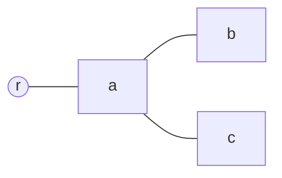
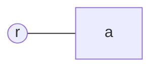
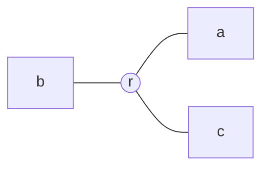
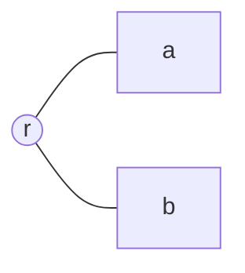
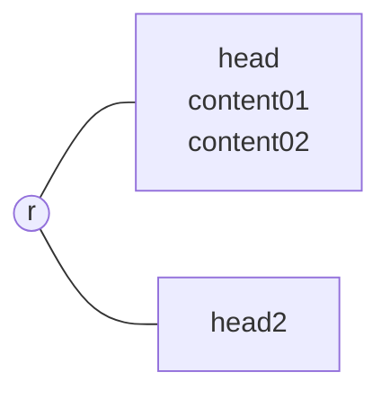
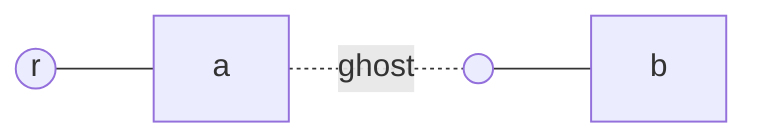
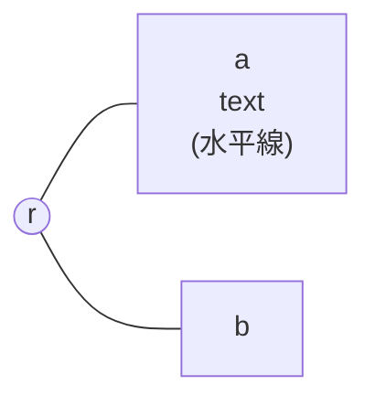
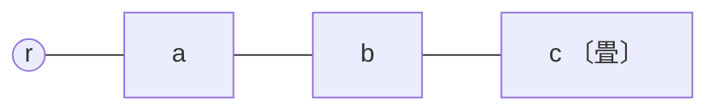
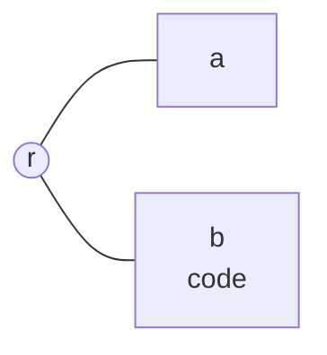
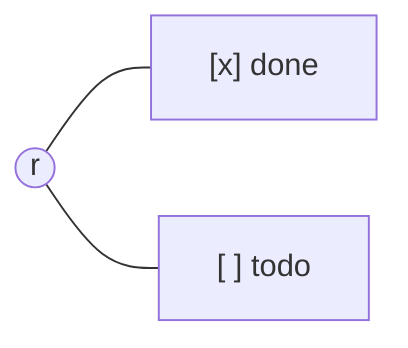

# 操作ケースカタログ

[文書モデル設計](2026-08-29-doc-model-design.md)（意味保全 + 綴りの所有）の語彙による
挙動の固定。形式は **元 md / 元 map (mermaid) / 操作 / 新 md**。

- 新 md は常に **serialize の正規形**（触った箇所だけでなく全文。法則 2 により以後は不動）
- map は `graph LR`（root 中央・左右に枝）。content・散文はノードの箱に `<br>` で積む。
  畳みは `〔畳〕`
- 操作は **実行の関数 + 日本語の説明** の 2 行

---

## C1: add — 形は正規形が決める

### 元 md

```md
# r

## a

- b
- c
```

### 元 map



### 操作

`add(a)`
a に子を追加する。

### 新 md

```md
# r

## a

- b
- c
- 
```

備考: 兄弟の真似という規則は消滅。この文書の `list_from` は 3（深さ 3 からリスト形）と
検出済みなので、深さ 3 の新子はリスト形。同じ文書に同じ深さの別形は存在しえない（正規形）。

---

## C2: add — 深さが list_from 未満なら見出し形

### 元 md

```md
# r

## a
```

### 元 map



### 操作

`add(a)`
a に最初の子を追加する。

### 新 md

```md
# r

## a

### 
```

---

## C3: delete — 側の列から区切りが再導出される

### 元 md

```md
# r

## a

---

## b

---

## c
```

### 元 map



### 操作

`delete(b)`
左側の唯一の枝 b を削除する。

### 新 md

```md
# r

## a

## c
```

備考: mmmAst の側の列が (右, 右) になり、serialize が変わり目ゼロ = 区切りゼロを書く。
「触った隙間」という概念は消滅 — 区切りは常に全文の側の列から導出される帰結。

---

## C4: flipSide — 先頭の枝も反転できる（先頭トグル）

### 元 md

```md
# r

## a

## b
```

### 元 map



### 操作

`flipSide(a)`
先頭の枝 a を左側へ移す。

### 新 md

```md
# r

---

## a

---

## b
```

備考: 側の列 (左, 右)。先頭スロットの前のトグルが「左開始」を表す（N30 の解決）。
どの側の列 2^N も一意に書ける。

---

## C5: move — 散文は中身ごと運ばれ、level は付け直される

### 元 md

```md
# r

## head

content01

***

content02

## head2
```

### 元 map



### 操作

`move(head, head2, 0)`
head を head2 の先頭の子へ移動する。

### 新 md

```md
# r

## head2

### head

content01

***

content02
```

備考: Opaque（散文・飾りの `***`）は中身ごとノードに付いて旅する。
head の level は移動先の深さ（親 + 1）に付け直される。子孫がいれば相対差を保って追従。

---

## C6: 階層飛びは構造なので正規形でも残る

### 元 md

```md
# r

## a

#### b
```

### 元 map



### 操作

`rename(a, "a2")`
a のラベルを打ち替える。

### 新 md

```md
# r

## a2

#### b
```

備考: level は構造（疑似階層）。`####` の飛びは正規化の対象ではなく、map には ghost
スロットが実体化される。rename は b に一切影響しない。

---

## C7: 飾りの水平線はチャンネル分離で救われる（初回スナップ）

### 元 md

```md
# r

## a

text

---

## b
```

### 元 map



### 操作

`flipSide(b)`
b を左側へ移す。

### 新 md

```md
# r

## a

text

***

---

## b
```

備考: body 内の水平線（Opaque）は `***` へ、側のトグルは `---` で書かれる（チャンネル分離）。
位置で意味が化ける事故（旧世界の料金所）が綴りの規則として構造的に消える。
`***` への書き替えは初回スナップの一部で、この文書では 1 回きり。

---

## C8: fold — details で畳む。ネストは保存される

### 元 md

```md
# r

## a

### b

<details>

#### c

</details>
```

### 元 map



### 操作

`fold(a)`
a を畳む。

### 新 md

```md
# r

## a

<details>

### b

<details>

#### c

</details>

</details>
```

備考: 骨格行 `## a` は外、details は本文と子だけを包む。内側の c の畳みは**吸収されず残る**
（HTML コメントと違い details はネスト可能）。開けば c は畳まれたまま出てくる。

---

## C9: 崩れた文書の初回スナップ

### 元 md

```md
# r

a
---

##   b   ##

    code
```

### 元 map



### 操作

`add(r)`
r に枝を追加する（最初の操作なら何でも同じ）。

### 新 md

```md
# r

## a

## b

```
code
```

## 
```

備考: setext → ATX、閉じ `#` と余白の除去、インデントコード → フェンス。
全文が一度で正規形になり（初回スナップ）、以後は冪等（法則 2）で不動。
**意味は 1 ビットも変わっていない** — 構造・順序・中身は完全に同じ。

---

## C10: task list はラベルの一部

### 元 md

```md
# r

- [x] done
- [ ] todo
```

### 元 map



### 操作

`rename(d, "[x] done!")`
d のラベルを打ち替える。

### 新 md

```md
# r

- [x] done!
- [ ] todo
```

備考: チェックボックスは当面ラベルの文字列（旗 3: 将来 done 属性へ昇格候補）。
往復は壊れない。

---

## C11: frontmatter は封筒のまま

### 元 md

```md
---
image-folder: img
---

# r

## a
```

### 元 map


### 操作

`flipSide(a)`
a を左側へ移す。

### 新 md

```md
---
image-folder: img
---

# r

---

## a
```

備考: head は parse の前段で切り出された逐語の封筒。先頭トグルは head の後・木の前に書かれ、
frontmatter の `---` と衝突しない（封筒の内側は隙間ではない）。

---

## C12: 打鍵の道 — 唯一の id の継ぎ目

### 元 md

```md
# r

## a

## b
```

### 元 map


### 操作

（md ペインで `## a` の行を `## a` → `## a2` と打鍵）

### 新 md

```md
# r

## a2

## b
```

備考: 打鍵はテキストが権威。parse → 新 mmmAst → project → map。
旧 a の id を新 a2 に引き継ぐのが世界で唯一の継ぎ目（被害は選択ズレ止まり）。
serialize は走らない（打鍵内容がそのまま文書。正規形かどうかは次の操作時のスナップに委ねる）。

---

## C13: 読みの道 — 文字列は md として解釈される

### 元 md

```md
# r

## a
```

### 元 map


### 操作

`rename(a, "1. x\ny")`
カードの入力欄に複数行のテキストを打つ。

### 新 md

```md
# r

## 1. x

y
```

備考: 一言語原則 — rename は読みの道を通り、入力は md として解釈される。
見出し行の中身として `1. x` が書かれ、続く `y` は a の flesh（Opaque）になる。
エスケープも拒否も無い: md ペインで同じ内容を打った場合と完全に同じ結果。
（リスト形のノードに `1. x` と打てば入れ子リストが生える — それも同じ原則の帰結）
