# put ケースカタログ

put の挙動をケースで固定する一覧。形式は **元 md / 元 map (mermaid) / 操作 / 新 md**。
備考には発火した規則を書く（規則の名前は [文書モデル設計](2026-08-29-doc-model-design.md) の語彙に合わせる）。

- map は常に `graph LR`（root 中央・左右に枝、mmm の絵と同じ向き）。
  左側の枝は `x --- r((r))`、右側は `r((r)) --- x` と書き分ける。
  content はノードの箱の中に `<br>` で積む。畳んだノードは `〔畳〕` を付ける。
- 操作は **実行の関数 + 日本語の説明** の 2 行で書く。
- 空ラベルの骨格行は `## ` `- ` と**末尾空白付き**で書く。空白が無いと
  打鍵の 1 文字目で `##a` になり見出しでなくなるため。lint の MD009 はここだけ例外。

---

# 1. add

## C1: 形の真似（リスト形の兄弟）

### 元 md

```md
# r

## a

- b
- c
```

### 元 map

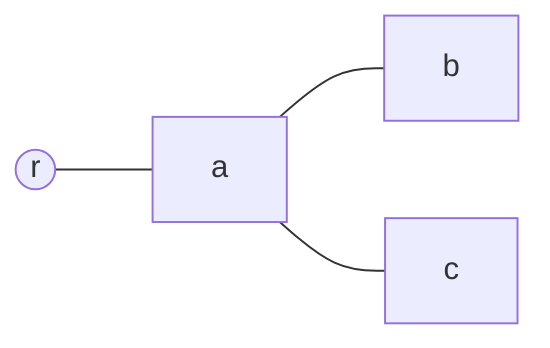

### 操作

`add(a)`
a に子を追加する。

### 新 md

```md
# r

## a

- b
- c
- 
```

備考: 最後の子 c がリスト形なので新しい子もリスト形（`### ` にしない）。
継ぎ目は兄弟の間隔を真似る → tight list のまま空行を挟まない。

---

## C2: 子なし → 親から導出

### 元 md

```md
# r

## a
```

### 元 map

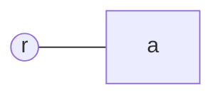

### 操作

`add(a)`
a に最初の子を追加する。

### 新 md

```md
# r

## a

### 
```

備考: 真似る兄弟が居ないので親の形から導出する（h2 → h3）。見出し形の継ぎ目は空行 1 本。

---

## C3: h6 の子 → リスト形へ落ちる

### 元 md

```md
# r

## a

### b

#### c

##### d

###### e
```

### 元 map

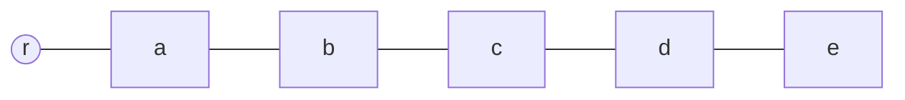

### 操作

`add(e)`
h6 のノード e に子を追加する。

### 新 md

```md
# r

## a

### b

#### c

##### d

###### e

- 
```

備考: 書く見出しは 6 で打ち止め、以深はリスト形。
読みは `#######`（7 個以上）も見出しとして受けるが、put が書くことはない。

---

## C4: ルートに枝を足す — 側の継承と、触っていない隙間の保全

### 元 md

```md
# r

## a

---

---

## b
```

### 元 map

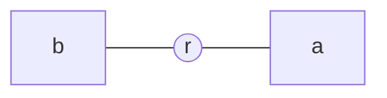

### 操作

`add(r)`
r に枝を追加する（末尾）。

### 新 md

```md
# r

## a

---

---

## b

## 
```

備考: 新しいスロットは最後のスロットの側（左）を継ぐ → 新しい隙間にトグル不要。
a|b の隙間は**触っていない**ので `---` の山はそのまま残る。区切りは有無だけが意味なので、
山が積まれていても読みは 1 トグルで正しい。

---

## C5: 空文書へ最初のルート

### 元 md

```md
```

### 元 map

（空）

### 操作

`add()`
文書に最初のルートを追加する。

### 新 md

```md
# 
```

---

# 2. delete

## C6: サブツリーごと削除

### 元 md

```md
# r

## a

### b

### c

## d
```

### 元 map

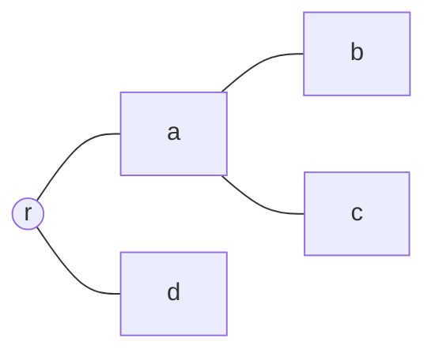

### 操作

`delete(a)`
a をサブツリーごと削除する。

### 新 md

```md
# r

## d
```

---

## C7: 自分だけ消して子を昇格

### 元 md

```md
# r

## a

### b

### c

## d
```

### 元 map


### 操作

`deleteOne(a)`
a だけを削除し、子を親へ昇格させる。

### 新 md

```md
# r

## b

## c

## d
```

備考: 子孫の骨格行が全部 1 段浅くなる（深さシフト）。実質 move 級の重さ。

---

## C8: 側の真ん中を消す — 隙間の併合と区切り再計算

### 元 md

```md
# r

## a

---

## b

---

## c
```

### 元 map

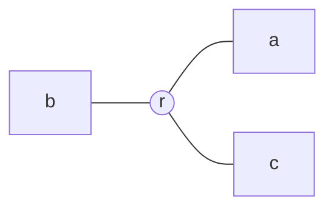

### 操作

`delete(b)`
左側の唯一の枝 b を削除する。

### 新 md

```md
# r

## a

## c
```

備考: 隙間 2 個が 1 個に併合 = 触った隙間。残った両隣 a, c は同じ側（右）
→ 欲しいトグル無し → 区切りを掃除。「側の列が意味、区切りはその投影」の 1 規則だけで決まり、
delete 固有の場合分けは無い。

---

## C9: 触っていない区切りは綴りごと保全

### 元 md

```md
# r

## a

***

## b

## c
```

### 元 map

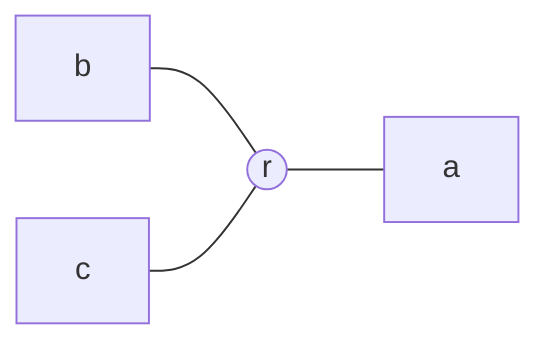

### 操作

`delete(c)`
左側の末尾の枝 c を削除する。

### 新 md

```md
# r

## a

***

## b
```

備考: `***` も区切りとして読む（銘柄・本数は無関係）。触った隙間は b|c だけなので、
a|b の `***` は正規形の `---` に直されずそのまま残る。

---

# 3. move / indent / outdent

## C10: flesh は逐語で旅する

### 元 md

```md
# r

## head

content01

---

content02

## head2
```

### 元 map

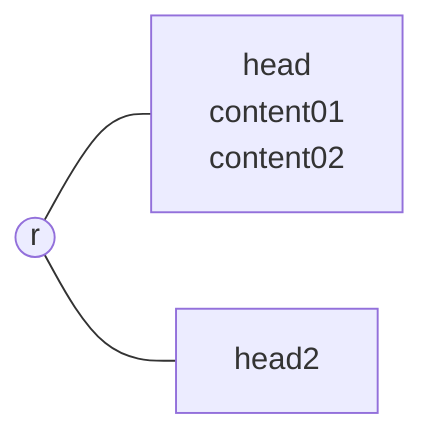

### 操作

`move(head, head2, 0)`
head を head2 の先頭の子へ移動する。

### 新 md

```md
# r

## head2

### head

content01

---

content02
```

備考: 骨格行だけ書き替え（`## head` → `### head`）。flesh は 1 バイトも動かない。
`---` は後ろに content02 が居るので隙間（空白と区切り線しか無い区間）に該当せず、
移動前も後も flesh のまま — トグルに化けない。区切り再計算の対象は純粋な隙間だけ。

---

## C11: リスト形サブツリーの再インデント

### 元 md

```md
# r

- a

  body

- b
```

### 元 map

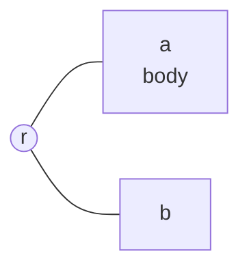

### 操作

`move(a, b, 0)`
a を b の子へ移動する。

### 新 md

```md
# r

- b

  - a

    body
```

備考: リスト形は字下げが深さなので、サブツリーの flesh も一様にシフトする（+2）。
見出し形では flesh が字下げされないので、この原始手術は**リスト形でしか発火しない**。

---

## C12: 見出し形 → リスト形への転形

### 元 md

```md
# r

## a

### b

#### c

##### d

###### e

###### f
```

### 元 map

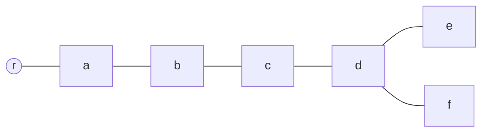

### 操作

`indent(f)`
f を 1 段深くする（e の子にする）。

### 新 md

```md
# r

## a

### b

#### c

##### d

###### e

- f
```

備考: 深さ 7 は見出しで書けないのでリスト形に転形する。骨格行 1 本の書き替えだけ。

---

## C13: ルート直下へ outdent — 側の割り当て

### 元 md

```md
# r

## a

### b
```

### 元 map

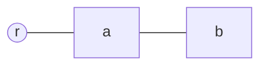

### 操作

`outdent(b)`
b を 1 段浅くする（r の枝にする）。

### 新 md

```md
# r

## a

## b
```

備考: 新しいスロットは直前のスロットの側を継ぐ（右）。トグル不要なので区切りは書かれない。
区切りの増減は操作の仕事ではなく投影の帰結。

---

## C14: 畳んだ落とし先は先に開く

### 元 md

```md
# r

<!--

## a

### b

-->

## c
```

### 元 map

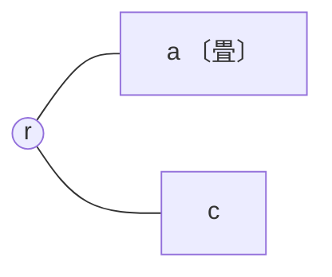

### 操作

`move(c, a, 1)`
c を a の末尾の子へ移動する。

### 新 md

```md
# r

## a

### b

### c
```

備考: PR #14 から引き継いだ UI 方針。開かずに入れると、入れた直後に map から消えるため。
マーカー対は除去され、a の hidden 旗が落ちる。

---

## C15: 自分の子孫へは移動できない

### 元 md

```md
# r

## a

### b
```

### 元 map


### 操作

`move(a, b, 0)`
a を自分の子孫 b の下へ移動しようとする。

### 新 md

```md
# r

## a

### b
```

備考: 木の語彙の段階で不正（循環）。put まで届かず拒否される。テキストは 1 バイトも動かない。

---

## C16: 階層飛びは触った行だけ正規化される

### 元 md

```md
# r

## a

#### b

## c
```

### 元 map

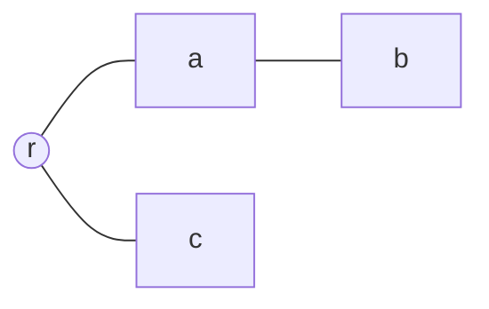

### 操作

`move(b, c, 0)`
b を c の先頭の子へ移動する。

### 新 md

```md
# r

## a

## c

### b
```

備考: 階層飛び `####` は読みでは深さ 2 と解決される（`#` の数ではなく木の位置が深さ）。
書き替えた行は正規の深さ `###` になる。**保全は「触らない限り」**が原則で、
触った骨格行は正規形に戻る — これが保全と正規化の境界線。

---

# 4. flipSide / 並べ替え

## C17: 真ん中を反転 → 両隣に区切り

### 元 md

```md
# r

## a

## b

## c
```

### 元 map

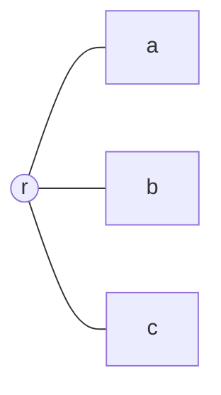

### 操作

`flipSide(b)`
b を左側へ移す。

### 新 md

```md
# r

## a

---

## b

---

## c
```

備考: 側の列が R,L,R になり、a|b と b|c の 2 隙間でトグルが要る。
ノードのバイトは完全に無傷 — flipSide が触るのは隙間だけ。

---

## C18: 列内並べ替え — 既存の区切りは無編集

### 元 md

```md
# r

## a

---

## b

## c
```

### 元 map


### 操作

`move(c, r, 1)`
c を左列の先頭（b の前）へ移動する。

### 新 md

```md
# r

## a

---

## c

## b
```

備考: 挿入点は b の骨格行の直前（隙間の末尾）。側の列は R,L,L のまま。
既存の `---` は新しい a|c の隙間に収まり、R→L のトグルとして正しいので**書き替えない**。
「有れば触らない」が保全を守る。

---

# 5. hidden

## C19: 畳む — 入れ子の吸収

### 元 md

```md
# r

## a

### b

<!--

### c

-->
```

### 元 map

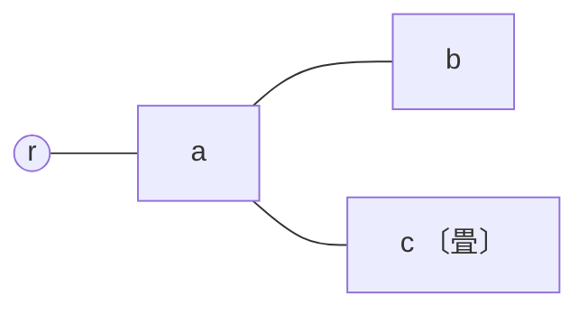

### 操作

`toggleHidden(a)`
a を畳む。

### 新 md

```md
# r

<!--

## a

### b

### c

-->
```

備考: HTML コメントは入れ子にできないので、包む前に内側のマーカー対を除去する（吸収）。
c の hidden 旗は消える — 開いたときに c は開いた状態で出てくる。

---

## C20: 1 つだけ開く — 領域の解散と包み直し

### 元 md

```md
# r

<!--

## a

## b

-->
```

### 元 map

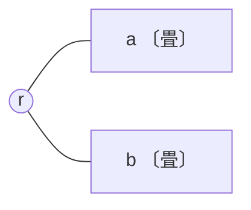

### 操作

`toggleHidden(a)`
a を開く。

### 新 md

```md
# r

## a

<!--

## b

-->
```

備考: 手書き md では 1 つの領域が兄弟を複数包みうる（旗と領域は 1:1 ではない）。
触った領域は解散し、残る hidden の兄弟を個別に包み直す — 局所スナップと同じ思想。

---

## C21: flesh に生の `-->` があると拒否

### 元 md

```md
# r

## a

arrow --> here
```

### 元 map

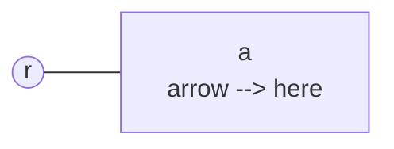

### 操作

`toggleHidden(a)`
a を畳もうとする。

### 新 md

```md
# r

## a

arrow --> here
```

備考: 包むと `-->` で早閉じし、後半が領域外へこぼれる。flesh は書き換えない方針なので
**操作を拒否**し、map に理由を出す。破れカタログ行き。

---

# 6. content

## C22: content の並べ替え — 不可視の散文は動かない

### 元 md

```md
# r

## a


body


```

### 元 map

```mermaid
graph LR
  r((r)) --- a["a<br>c01<br>c02<br>c03"]
```

### 操作

`moveContent(c03, a, 1)`
c03 を c01 と c02 の間へ移動する。

### 新 md

```md
# r

## a


body


```

備考: 散文 body は model に登録されない不可視の同居人。
挿入点の規約は「**次の content のスパン直前**」なので、body は直前の content c01 に接着したまま動かない。

---

## C23: content 追加で tight list が loose 化する

### 元 md

```md
# r

- a
- b
```

### 元 map

```mermaid
graph LR
  r((r)) --- a
  r --- b
```

### 操作

`addContent(a, image)`
a に画像 content を追加する。

### 新 md

```md
# r

- a

  

- b
```

備考: 項目にブロックを入れると CommonMark の規則でリスト全体が loose 化し、
b のバイトは無傷なのに b の**レンダリングが変わる**。model は同一なので map には影響しない。
爆風半径の実例 — 「意図どおり」を丸めた側に落ちる。

---

# 7. 嫌がらせ（横断的なエッジケース）

## C24: 段落の直後に区切りを書くと setext になる

### 元 md

```md
# r

## a

text

## b
```

### 元 map

```mermaid
graph LR
  r((r)) --- a["a<br>text"]
  r --- b
```

### 操作

`flipSide(b)`
b を左側へ移す。

### 新 md

```md
# r

## a

text

---

## b
```

備考: `text` の直後に空行なしで `---` を書くと setext h2「text」になり、
段落がノードに化ける。**空行規律（区切りの前に空行 1 本）**がこの罠を構造的に防いでいる。
規律が作法ではなく安全装置であることの実例。

---

## C25: フェンス内の `#` と `---` は無視される

### 元 md

````md
# r

## a

```md
# not a heading
---
```

## b
````

### 元 map

```mermaid
graph LR
  r((r)) --- a["a<br>code"]
  r --- b
```

### 操作

`move(a, b, 0)`
a を b の子へ移動する。

### 新 md

````md
# r

## b

### a

```md
# not a heading
---
```
````

備考: フェンス内は parse の段階で不可侵。骨格でも隙間でもないので、
`# not a heading` はノードにならず、`---` はトグルにならず、逐語で旅する。

---

## C26: frontmatter の `---` は封筒

### 元 md

```md
---
image-folder: img
---

# r

## a

## b
```

### 元 map

```mermaid
graph LR
  r((r)) --- a
  r --- b
```

### 操作

`flipSide(b)`
b を左側へ移す。

### 新 md

```md
---
image-folder: img
---

# r

## a

---

## b
```

備考: 先頭の `---` 対は封筒であって枝の隙間ではないので、区切り再計算の対象外。
文書の頭にある `---` を側のトグルと読まないのは、この位置の特別扱い 1 つだけで足りる。

---

## C27: ルートとルートの間の `---` は側ではない

### 元 md

```md
# r1

---

# r2
```

### 元 map

```mermaid
graph LR
  r1((r1))
  r2((r2))
```

### 操作

`add(r2)`
r2 に子を追加する。

### 新 md

```md
# r1

---

# r2

## 
```

備考: side は Root の**枝**のスロットに付く属性なので、木と木の間の `---` は意味を持たない。
model に登録されず、触られないので保全される。

---

## C28: setext 見出しは触るまで残る

### 元 md

```md
# r

a
---

## b
```

### 元 map

```mermaid
graph LR
  r((r)) --- a
  r --- b
```

### 操作

`add(a)`
a に子を追加する。

### 新 md

```md
# r

a
---

### 

## b
```

備考: `a` + `---` は CommonMark どおり setext h2 として読む（区切り判定より前段で解決）。
put が書くのは常に ATX なので、原文の setext は**触らない限り**残り、文書内で混在する。
a 自身の骨格行を書き替える操作（深さ変更・rename）で初めて ATX になる。

---

## C29: インデントコードブロックを含むリストの再インデント

### 元 md

```md
# r

- a

      code

- b
```

### 元 map

```mermaid
graph LR
  r((r)) --- a["a<br>code"]
  r --- b
```

### 操作

`move(a, b, 0)`
a を b の子へ移動する。

### 新 md

```md
# r

- b

  - a

        code
```

備考: content indent が 2 → 4 になるので flesh を一様に +2 シフト（6 → 8 スペース）。
一様シフトならブロックの型は保たれる。**put の後に再パースしてブロック型の列が
一致することを検査する**（型不変）— 再インデントは put 全体で最も危険な原始手術なので、
ここだけ機械的な事後検査を置く。
